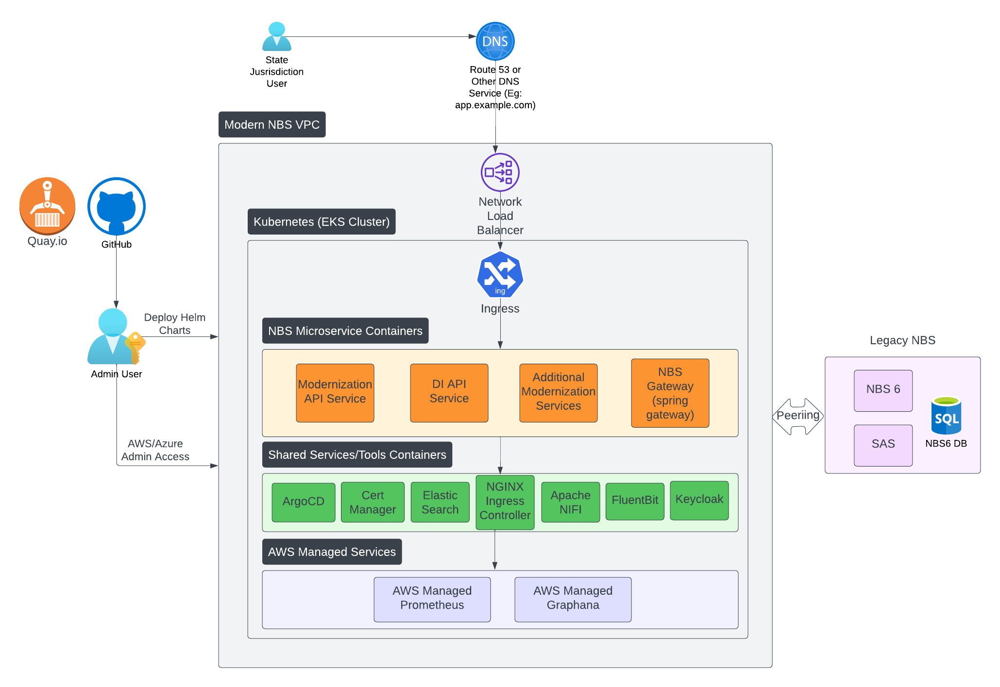

# NBS 7 architecture and microservices
{: .no_toc}

## On this page
{: .no_toc .text-delta }

1. TOC
{:toc}

---

## Overview

The deployment of the modernized NBS 7 complements and builds upon the existing NBS 6 system, integrating through the strangler fig pattern. Users experience a smooth transition between the modern NBS 7 features and legacy NBS 6.

To prevent disruptions to the existing NBS 6 deployment, NBS 7 runs on a dedicated cloud network. A dedicated connection links the NBS 7 and NBS 6 network environments so that the systems can communicate.

## Architecture

This diagram illustrates the key components of NBS 7.

## Infrastructure as Code (IaC)

NBS 7 uses an [infrastructure as code](https://en.wikipedia.org/wiki/Infrastructure_as_code) approach. [Terraform](https://www.terraform.io/) provisions the cloud network, [Kubernetes](https://kubernetes.io/) cluster, and supporting infrastructure. [Helm](https://helm.sh/) automates the deployment of supporting services such as Fluent Bit and cert-manager. All code is available in [GitHub](https://github.com/CDCgov).

## NBS Microservices

NBS 7 introduces microservices for the modernized system, deployed using Helm charts:

- **Modernization API Service**: This service incorporates essential NBS 7 features such as patient search, event search, patient profile, investigations, etc.
- **NBS-gateway Service**: Leveraging Spring Cloud Gateway, this service efficiently manages intricate strangler routing logic between NBS 7 and NBS 6.
- **Data Ingestion API Service**: Our dedicated service provides essential APIs that enable NBS to seamlessly ingest HL7 data from labs and other entities into the NBS system.

## Traefik Kubernetes Ingress provider

Serving as the entry point into the Kubernetes cluster, the Traefik Kubernetes Ingress provider intelligently routes users based on predefined routing rules. Users are directed to the NBS 7 features (Modernization API Service) or classic NBS 6 features (NBS-gateway Service). The deployment of Traefik is orchestrated using Helm charts and values files.

## Shared services, tools, and containers

The following tools run alongside NBS 7 microservices to provide supporting infrastructure for certificate management, search, data flow, and logging.

- **Cert Manager**: This tool automates TLS certificate management and is integrated into the infrastructure through Terraform. The certificate issuer connects to the **Let's Encrypt** Certificate Authority by default and is installed using YAML manifests and `kubectl` commands.
- **Apache NiFi**: As an ETL tool, Apache NiFi populates Elasticsearch indices from the NBS database. Deployment of NiFi uses Helm charts and values files.
- **Elasticsearch**: NBS relies on Elasticsearch for lightning-fast searches. The deployment of Elasticsearch uses Helm charts and values files.
- **Fluent Bit**: Fluent Bit serves as the log aggregator, collecting logs from various microservices and Kubernetes components and, by default, pushing them to designated cloud storage and monitoring services.

## Data Ingestion service

The Data Ingestion service provides necessary foundational pieces to track and route electronic lab report (ELR) data flowing into NBS, and lays the groundwork to provide additional ingestion options.

- Accepts a variety of electronic lab reports using different versions and fields
- Saves all incoming messages for auditing, debugging, and disaster recovery and you can configure how long messages are saved
- Verifies all input data (HL7) against standard rules and provides an error when rejected
- Supports both positive and negative lab results with the appropriate code
- Provides both syntactic and semantic validations
- Removes unwanted data such as extraneous logs using filters
- Provides duplication checks to see if the data has made it through the system before
- Includes error handling and logging for both business data and operation data for situational awareness
- Supports traffic and system health monitoring

## Real-Time Reporting (RTR) microservices
Real-Time Reporting (RTR) provides rapid transformation and delivery of data from the transactional database (`NBS_ODSE`) to the reporting database (`RDB`). For detailed RTR deployment instructions, see [Deploy real-time reporting](../deploy-nbs7/real-time-reporting/real-time-reporting.html).

The following services comprise RTR:

- **Reporting Pipeline service**: Consumes ODSE/SRTE change events from Kafka, transforms them via stored procedures, and hydrates the reporting database's dimensions, facts, and datamarts in near real time.
- **Debezium service**: Monitors and streams the selected list of `NBS_ODSE` and `NBS_SRTE` tables to Kafka topics
- **Kafka sink service**: Persists the data from the Kafka topics to the `RDB_Modern` database tables

## Data processing service

The NBS 7 data processing service provides a way to process electronic lab reports (ELRs) in near real-time instead of depending on the system-bounded ELR batch job.

## Keycloak

Keycloak is an open-source identity and access management tool. NBS 7 uses Keycloak as the primary Identity Provider (IdP) for authentication, token management, and SSO integration with external identity providers such as Okta using OAuth or SAML.
