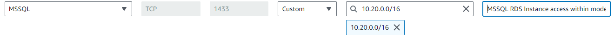
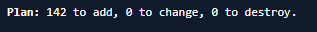

# Provision the AWS cloud environment
{: .no_toc }

## On this page
{: .no_toc .text-delta }

1. TOC
{:toc}

## Overview

This page covers the first deployment phase: provisioning the AWS cloud environment using Terraform. Complete the steps in this section before proceeding to [Initial Kubernetes Deployment](../initial-kubernetes-deployment/).

1. Download the Terraform configuration package from GitHub. Make sure you go through the release page and see what's included in
the current release on [CDCgov/NEDSS-Infrastructure](https://github.com/CDCgov/NEDSS-Infrastructure/releases)
1. Open bash/mac/cloudshell/powershell and unzip the current version file downloaded in the previous step named nbs-infrastructure-vX.Y.Z zip.
1. Create a new directory with an easily identifiable name e.g nbs7-mySTLT-test in /terraform/aws/ to hold your environment specific
configuration files
1. Copy terraform/aws/samples/NBS7_standard to the new directory and change into the new directory (Note: the samples directory
   contains other options than "standard", view the README file in that directory to chose most appropriate starting point)

   ```bash
   cp -pr terraform/aws/samples/NBS7_standard/* terraform/aws/nbs7-mySTLT-test
   cd terraform/aws/nbs7-mySTLT-test
   ```

   > Before you edit `terraform.tfvars` and `terraform.tf` files below, you can reference detailed information for each TF module under `terraform/aws/app-infrastructure` in a README file in each module's directory. Do not edit files in the individual modules.
   {: .note }

1. Update the `terraform.tfvars` and `terraform.tf` with your environment-specific values by following the [NEDSS infrastructure sample configuration instructions](https://github.com/CDCgov/NEDSS-Infrastructure/blob/main/terraform/aws/samples/README.md)
1. Review the inbound rules on the security groups attached to your database instance and ensure that the CIDR you intend to use with your NBS 7 VPC (`modern-cidr`) is allowed to access the database.
    - a. For example if the `modern-cidr` is `10.20.0.0/16`, there should be at least one rule in a security group associated to your database that allows MSSQL inbound access from your `modern-cidr` block
    
1. Make sure you are authenticated to AWS. Confirm access to the intended account using the following command. (More information is available in the [AWS CLI credential configuration guide](https://docs.aws.amazon.com/cli/latest/userguide/cli-configure-files.html).)

   ```text
   $ aws sts get-caller-identity
   {
       "UserId": "AIDBZMOZ03E7R88J3DBTZ",
       "Account": "123456789012",
       "Arn": "arn:aws:iam::123456789012:user/lincolna"
   }
   ```

1. Terraform stores its state in an S3 bucket. The commands below assume that you are running Terraform authenticated to the same AWS account that contains your existing NBS 6 application. Please adjust accordingly if this does not match your setup.
   1. Change directory to the account configuration directory if not already, i.e. the one containing `terraform.tfvars`, and `terraform.tf`

    ```text
    cd terraform/aws/nbs7-mySTLT-test
    ```

   1. Initialize Terraform by running:

    ```text
    terraform init
    ```

   1. Run "terraform plan" to enable it to calculate the set of changes that need to be applied:

    ```text
    terraform plan
    ```

    
   1. Review the changes carefully to make sure that they 1) match your intention, and 2) do not unintentionally disturb other configuration on which you depend. Then run "terraform apply":

    ```text
    terraform apply
    ```

    1. If terraform apply generates errors, review and resolve the errors, and then rerun step d.
1. Verify Terraform was applied as expected by examining the logs
1. Verify the [newly created VPC and subnets](https://us-east-1.console.aws.amazon.com/vpc/home?region=us-east-1#Home:) were created as expected and confirm that the CIDR blocks you defined exist in the Route Tables.
1. Verify the [Amazon Elastic Kubernetes Service (Amazon EKS) cluster](https://us-east-1.console.aws.amazon.com/eks/home?region=us-east-1#/clusters) was created by selecting the cluster and inspecting Resources->Pods, Compute (expect 30+ pods at this point, and 3-5 compute nodes as per the min/max nodes defined in terraform/aws/app-infrastructure/eks-nbs/variables.tf).
1. Now that the infrastructure has been created using Terraform, deploy Kubernetes support services in the Kubernetes cluster via the following steps.
    - Start the Terminal/command line:
        - Make sure you are still authenticated with AWS (reference the [Configuration and credential file settings](https://docs.aws.amazon.com/cli/latest/userguide/cli-configure-files.html)).
        - Authenticate into the Amazon EKS cluster using the following command and the [cluster name that you deployed in the environment](https://docs.aws.amazon.com/eks/latest/userguide/create-kubeconfig.html)

           ```bash
           aws eks --region us-east-1 update-kubeconfig --name <clustername> # e.g. cdc-nbs-sandbox
           ```

        - If the above command errors out, confirm that:
           - There are no issues with the AWS CLI installation
           - You have set the correct AWS environment variables
           - You are using the correct cluster name (as shown in the Amazon EKS console)
    - Run the following command to check if you are able to run commands to interact with the Kubernetes objects and the cluster:

      ```bash
      kubectl get pods --namespace=cert-manager
      ```

      This command should return 3 pods.  If it doesn't, refresh the AWS credentials and repeat the verification steps.
1. List the worker nodes for the cluster:

   ```bash
   kubectl get nodes
   ```

You have now installed your core infrastructure and Kubernetes cluster. Next, see [Initial Kubernetes Deployment](../initial-kubernetes-deployment/initial-kubernetes-deployment.html) to configure your cluster using Helm charts.
