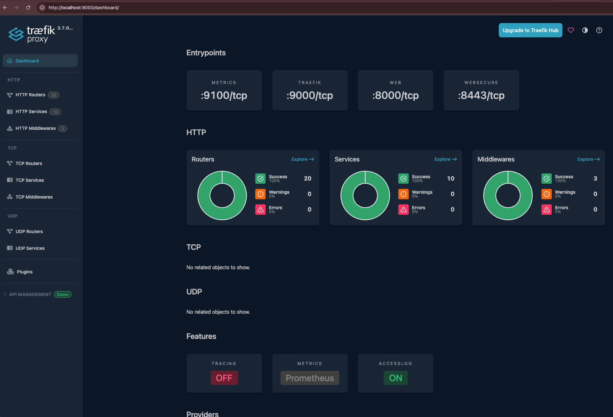

# Deploy core Kubernetes services

This page covers how to deploy the core services that must be running in your Kubernetes cluster before you deploy the NBS 7 microservices: the Traefik ingress controller, cert-manager, and the Cluster Autoscaler. Complete the sections on this page in order, then continue to [Deploy and configure Keycloak](deploy-keycloak.html), which is also a core service.

> The `kubectl` commands on this page require the cluster connection you configured in [Connect to Kubernetes cluster](../provision-cloud-infrastructure/provision-cloud-environment.html#connect-to-kubernetes-cluster).
{: .note }

## On this page
{: .no_toc .text-delta }

1. TOC
{:toc}

## Get the NEDSS-Helm charts

Complete these steps to download the Helm charts that deploy the core services and the NBS 7 microservices:

1. Go to the [NEDSS-Helm {{ site.version_latest_tag }} release page][nedss-helm-release-page]. Under **Assets**, download the `nbs-helm-{{ site.version_latest_tag }}.zip` file.
1. Unzip the downloaded file.
1. In a terminal, change into the `charts` directory from the unzipped file:

   ```bash
   cd <HELM_DIR>/nbs-helm-{{ site.version_latest_tag }}/charts
   ```

Run all `helm` commands on this page from this `charts` directory.

<!-- The "Create secrets in your cluster" section was deleted per Josh Olson's confirmation (2026-07-06): nbs-secrets.yaml was removed from NEDSS-Helm. See STLT-538 for reporting-pipeline-service credential configuration. -->

## Deploy Traefik ingress controller

The Traefik Helm chart in the [NEDSS-Helm repository][nedss-helm-repo] sets up Prometheus metrics, configures Linkerd sidecar injection for the `traefik` Kubernetes deployment, sets timeouts, and instructs the Traefik controller to create a Network Load Balancer (NLB) in AWS or an internal load balancer in Azure. This section covers how to deploy the Traefik controller, deploy the NBS ingress resources, and create the DNS records that route traffic to them.

### Deploy the Traefik controller

1. In the `traefik` chart directory, open the values file for your cloud provider:
   - **AWS:** `traefik/values.yaml`
   - **Azure:** `traefik/values-azure.yaml`
1. Confirm that the `deployment` section of that file contains the following pod annotation:

   ```yaml
   podAnnotations:
     linkerd.io/inject: enabled
   ```

1. Optional: To make the `kubectl logs` command return more information if you encounter issues, change `INFO` to `DEBUG` in the following snippet in that file:

   ```yaml
   logs:
     general:
       level: INFO
   ```

1. Add the Traefik Helm chart repository and update it:

   ```bash
   helm repo add traefik https://traefik.github.io/charts
   helm repo update
   ```

1. Deploy the Traefik controller to your Kubernetes cluster with the command for your cloud provider:
   - **AWS:**

     ```bash
     helm install traefik traefik/traefik --namespace traefik --create-namespace -f ./traefik/values.yaml
     ```

   - **Azure:**

     ```bash
     helm install traefik traefik/traefik --namespace traefik --create-namespace -f ./traefik/values-azure.yaml
     ```

   > If your AKS cluster has Windows node pools, for example for NBS 6, append the following option to the Azure command so that Traefik is scheduled on a Linux node: `--set nodeSelector."kubernetes\.io/os"=linux`
   {: .note }

1. **Wait for the deployment to complete:** Run the following command and verify that it prints that the deployment was successfully rolled out:

   ```text
   $ kubectl rollout status deployment/traefik -n traefik
   deployment "traefik" successfully rolled out
   ```

1. **Confirm the Traefik pod is healthy:** Run the following command and verify that the pod has a `STATUS` of `Running` and that the two numbers in the `READY` column match:

   ```text
   $ kubectl get pods -n traefik
   NAME                                          READY   STATUS    RESTARTS   AGE
   traefik-<POD-TEMPLATE-HASH>-<RANDOM-STRING>   2/2     Running   0          5m
   ```

1. **Get the Traefik load balancer address:** Run the following command and confirm that ports 80 and 443 are listed under the `PORT(S)` column. The example output is from AWS:

   ```text
   $ kubectl get svc -n traefik
   NAME      TYPE           CLUSTER-IP       EXTERNAL-IP                                          PORT(S)                                  AGE
   traefik   LoadBalancer   172.xx.xxx.xxx   [HASH]-[RANDOM-ID].elb.[YOUR-REGION].amazonaws.com   80:[NODEPORT1]/TCP,443:[NODEPORT1]/TCP   6m
   ```

> Each instance of `[HASH]-[RANDOM-ID].elb.[YOUR-REGION].amazonaws.com` on this page refers to the same value: the address of your Traefik load balancer. For AWS, this is an NLB hostname. For Azure, this is an IP address.
{: .note }

### Deploy NBS ingress resources

The `nbs-ingress` Helm chart manages all ingress routing between the NBS 7 applications deployed to your Kubernetes cluster. Complete these steps to deploy it:

1. In the `nbs-ingress/values.yaml` file (the same file is used for AWS and Azure), search for `EXAMPLE` and fill in your environment-specific values. The [Helm values reference for NBS 7 microservices][helm-values-table] lists the values to use.
1. Deploy the ingress resources to your Kubernetes cluster:

   ```bash
   helm install nbs-ingress ./nbs-ingress -n default -f ./nbs-ingress/values.yaml
   ```

1. Verify that the ingress resources were created. If you use PowerShell, replace `grep -E` with `Select-String`. The example output is from AWS:

   ```text
   $ kubectl get ingress -A | grep -E "NAME|traefik"
   NAMESPACE   NAME                        CLASS     HOSTS                  ADDRESS                                              PORTS     AGE
   default     nbs-ingress-dataingestion   traefik   <YOUR-DATA-HOSTNAME>   [HASH]-[RANDOM-ID].elb.[YOUR-REGION].amazonaws.com   80, 443   5m
   default     nbs-ingress-main            traefik   <YOUR-APP-HOSTNAME>    [HASH]-[RANDOM-ID].elb.[YOUR-REGION].amazonaws.com   80, 443   5m
   ```

### Create DNS records

Create A records in your Domain Name System (DNS) service, such as Amazon Route 53 or Azure DNS, that point to the address of the Traefik load balancer:

1. **Retrieve the load balancer address:** The `kubectl get svc -n traefik` command in [Deploy the Traefik controller](#deploy-the-traefik-controller) printed the address of the Traefik load balancer under the `EXTERNAL-IP` column. Rerun that command if you need to retrieve the address again.
1. **Create the records:** Create an A record for each hostname in the following table. Replace `<DOMAIN_NAME.TLD>` with your site and domain names from the [Helm values reference for NBS 7 microservices][helm-values-table]:

   | Subdomain description | Hostname | Example |
   |-----------------------|----------|---------|
   | NBS application | `app.<DOMAIN_NAME.TLD>` | `app.nbsdemo.com` |
   | Data services | `data.<DOMAIN_NAME.TLD>` | `data.nbsdemo.com` |
   | NiFi (use with caution) | `nifi.<DOMAIN_NAME.TLD>` | `nifi.nbsdemo.com` |

   > NiFi has known security vulnerabilities. Add a NiFi DNS record only if you need to administer NiFi directly. Otherwise, omit it.
   {: .important }

   To create the records in your cloud provider:
   - **AWS:** In the AWS Management Console, go to **Route 53** > **Hosted Zones** and select your hosted zone. Make note of your **Hosted zone ID**, because the verification step uses it. Create or edit each A record from the table so that its **Route traffic to** target is the hostname of your Traefik load balancer.
   - **Azure:** In the Azure Portal, go to **DNS Zones** and select your DNS zone. Create or edit each A record from the table so that it points to the IP address of your Application Gateway.
1. **Verify the records:** For each record you created, run the following `nslookup` command and verify that it does not print an error such as `server can't find`. Records typically propagate within 60 seconds. If you encounter an error, rerun the command periodically for up to 5 minutes until it prints no error:

   ```bash
   nslookup app.<DOMAIN_NAME.TLD>
   ```

   For Azure, verify that the command prints the IP address of your Traefik load balancer.

   For AWS, the `nslookup` command prints other IP addresses, so run the following command instead to verify the record target. Fill in your values in the strings surrounded by angle brackets, and verify that the output is the hostname of your Traefik load balancer:

   ```text
   $ aws route53 list-resource-record-sets \
     --hosted-zone-id <YOUR_AWS_ROUTE53_HOSTED_ZONE_ID> \
     --query "ResourceRecordSets[?Name=='app.<DOMAIN_NAME.TLD>.'].AliasTarget.DNSName" \
     --output text
   [HASH]-[RANDOM-ID].elb.[YOUR-REGION].amazonaws.com
   ```

<!-- The "Final validation of Traefik and Keycloak" section moved to the end of Deploy and configure Keycloak per DEV-265 comment 41, because it depends on Keycloak. -->

### Troubleshoot Traefik

If you encounter issues when you deploy or verify Traefik, the following sections provide suggestions.

#### Access the Traefik dashboard

The Traefik dashboard lets you inspect routers, services, and middleware:

1. Run the following command, which creates a secure, temporary network tunnel between your local machine and the `traefik` pod in your Kubernetes cluster. Leave the command running:

   ```text
   $ kubectl port-forward -n traefik deployment/traefik 9000:9000
   Forwarding from 127.0.0.1:9000 -> 9000
   Forwarding from [::1]:9000 -> 9000
   ```

1. Go to `http://localhost:9000/dashboard/` in your browser to access the Traefik dashboard. The following screenshot shows the dashboard:

   <!-- RELEASE CHECKLIST: UI screenshot; reverify against the Traefik version shipped with each release. -->
   

1. When you finish using the dashboard, press Ctrl+C in the terminal that is running the port-forward command to stop the tunnel.

#### View Traefik logs

To print the most recent Traefik log entries, run the following command:

```bash
kubectl logs -n traefik deployment/traefik -c traefik --tail=100
```

#### Common Traefik issue

- **502 Bad Gateway:** Run the following command and confirm that ports 8443 and 8000 are listed under the `ENDPOINTS` column:

  ```text
  $ kubectl get endpoints -n traefik
  NAME      ENDPOINTS                                     AGE
  traefik   [POD-IP-ADDRESS]:8443,[POD-IP-ADDRESS]:8000   10m
  ```

#### Get support

If issues persist after you complete the troubleshooting steps, email [nbs@cdc.gov](mailto:nbs@cdc.gov).

## Configure cert-manager (optional)

cert-manager is a core service that Terraform deploys when you provision your cloud environment. It creates Transport Layer Security (TLS) certificates for workloads in your cluster and renews the certificates before they expire. By default, cert-manager uses [Let's Encrypt](https://letsencrypt.org/) as the certificate authority for the NiFi and modernization-api services.

> If you have manual certificates, skip steps 1 - 4 and store your certificates in Kubernetes secrets instead. For more information, see the [Kubernetes Secrets documentation](https://kubernetes.io/docs/concepts/configuration/secret/).
{: .note }

1. Locate the cluster issuer manifest at [`k8-manifests/cluster-issuer-prod.yaml`][nedss-helm-cluster-issuer-manifest] in the NEDSS-Helm repository.

1. In `cluster-issuer-prod.yaml`, update the email address to a valid operations address. Let's Encrypt uses this address to notify you of upcoming certificate expirations if automatic renewal stops working.

1. Apply the manifest:

   ```bash
   cd <HELM_DIR>/k8-manifests
   kubectl apply -f cluster-issuer-prod.yaml
   ```

1. Verify that the cluster issuer is deployed and in a ready state. You should see `letsencrypt-production` with a `READY` status of `True`:

   ```bash
   kubectl get clusterissuer
   ```

   <!-- RELEASE CHECKLIST: UI screenshot; reverify each release. -->
   

## Deploy Cluster Autoscaler (AWS only)

The Cluster Autoscaler is a Helm chart that horizontally scales cluster nodes as needed.

> AKS clusters usually include a built-in cluster autoscaler, so this section applies to AWS only.
{: .note }

1. Update the following values in `charts/cluster-autoscaler/values.yaml` with values from the AWS console:

   ```yaml
   clusterName: <EXAMPLE_EKS_CLUSTER_NAME>
   autoscalingGroups:
     - name: <EXAMPLE_AWS_AUTOSCALING_GROUP_NAME>
       maxSize: 5
       minSize: 3
   awsRegion: <YOUR_AWS_REGION>
   ```

1. Install the chart:

   ```bash
   helm repo add autoscaler https://kubernetes.github.io/autoscaler
   helm upgrade --install cluster-autoscaler autoscaler/cluster-autoscaler \
     -f ./cluster-autoscaler/values.yaml \
     --namespace kube-system
   ```

1. Verify that the Cluster Autoscaler pod is running:

   ```bash
   kubectl --namespace=kube-system get pods | grep cluster-autoscaler
   ```

## Next steps

Continue to [Deploy and configure Keycloak](deploy-keycloak.html).

[nedss-helm-release-page]: <https://github.com/CDCgov/NEDSS-Helm/releases/tag/{{ site.version_latest_tag }}>
[nedss-helm-repo]: <https://github.com/CDCgov/NEDSS-Helm>
[nedss-helm-cluster-issuer-manifest]: <https://github.com/CDCgov/NEDSS-Helm/blob/{{ site.version_latest_tag }}/k8-manifests/cluster-issuer-prod.yaml>
[helm-values-table]: <../../microservices-deployment/deploy-nbs7-microservices.html#helm-values-reference-for-nbs-7-microservices>
