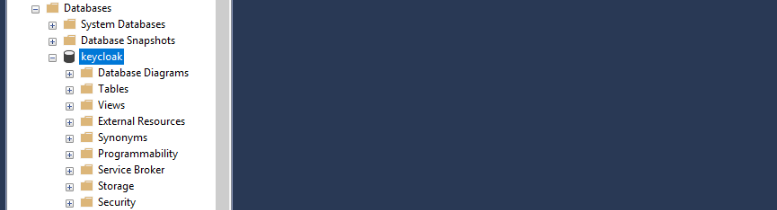
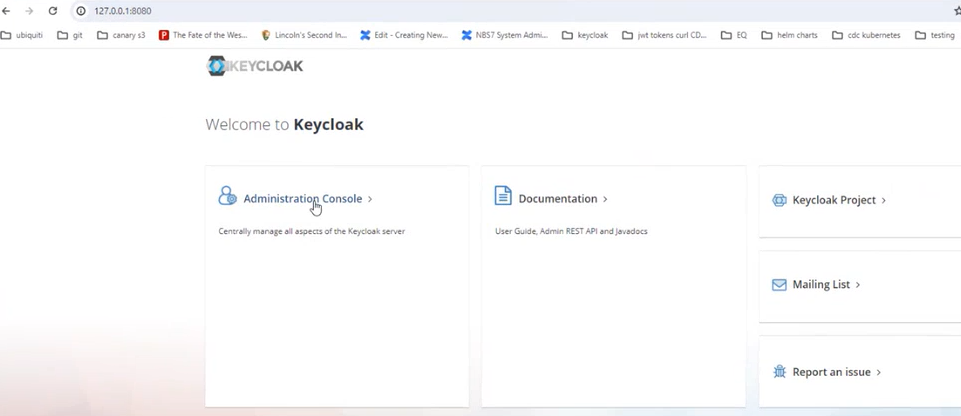
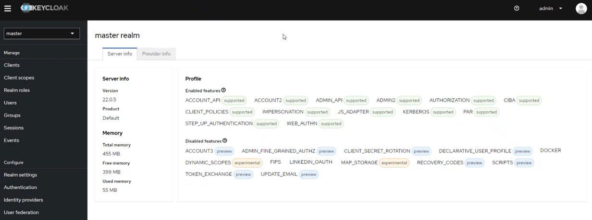
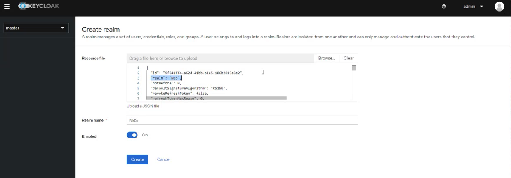
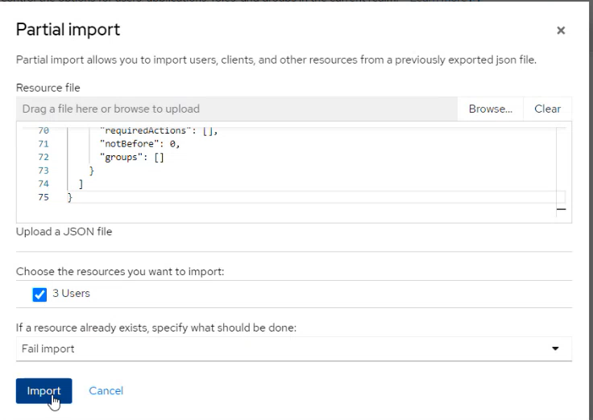
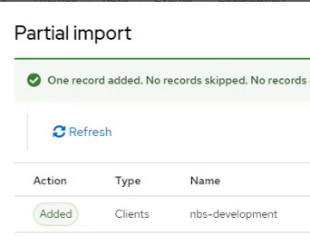
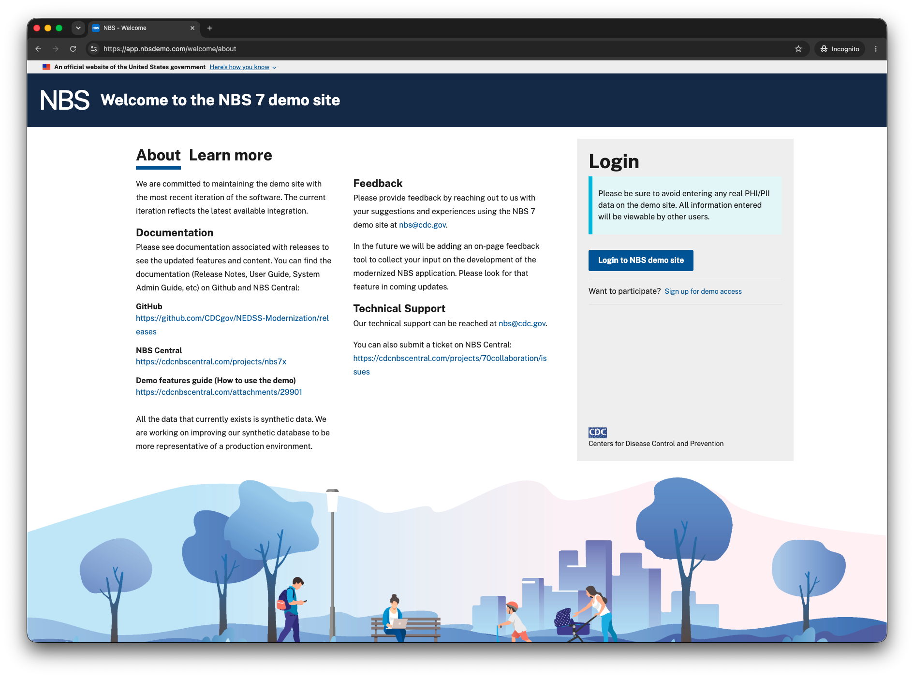
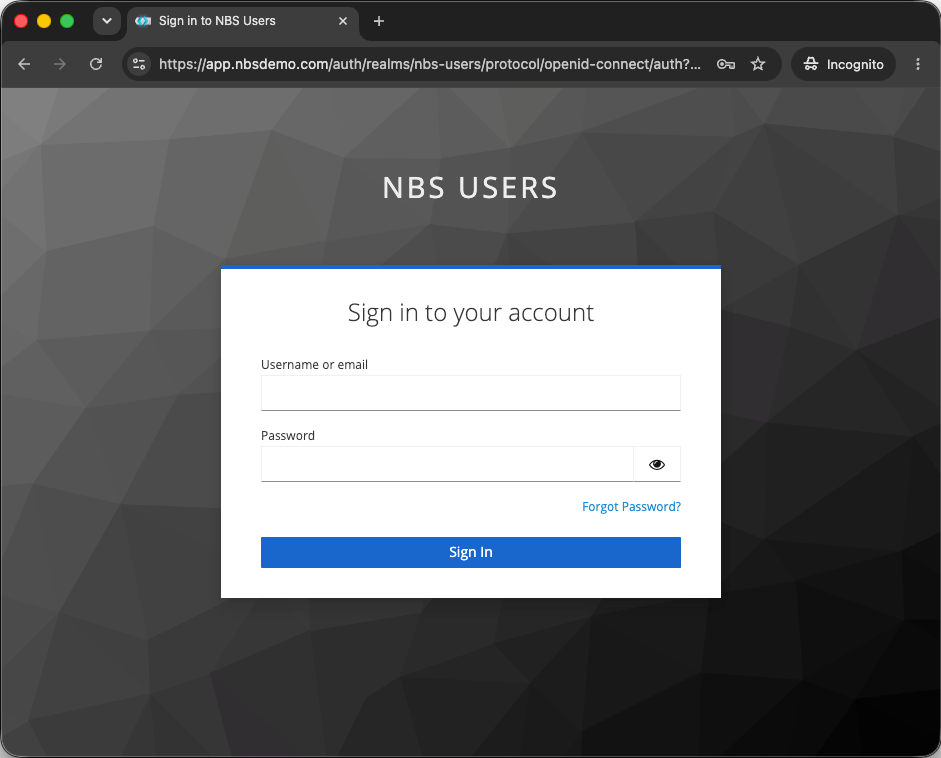
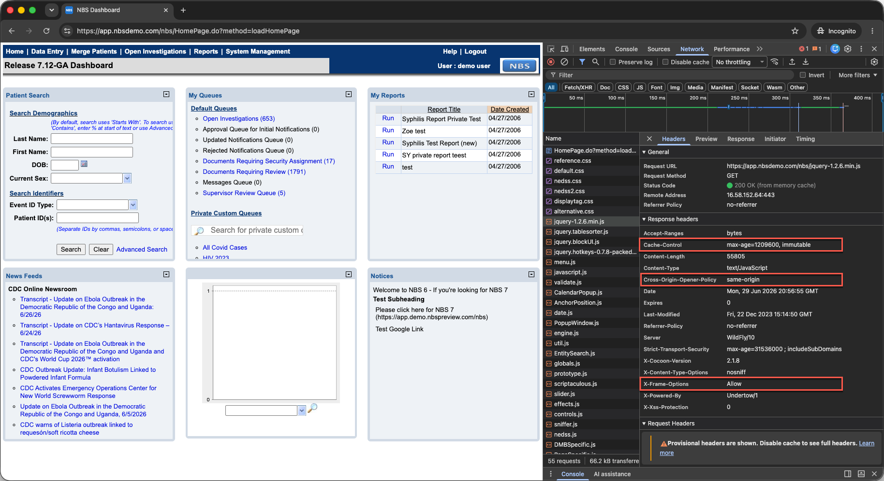
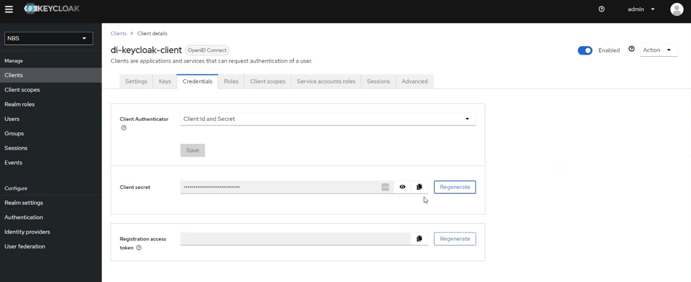

# Deploy and configure Keycloak for NBS 7

In addition to the services you deployed in [Deploy core Kubernetes services](deploy-core-services.html), Keycloak is also a core service. Keycloak is the authentication service that allows users to sign in to the NBS 7 web UI. This page covers how to install Keycloak and configure the authentication setup that the NBS 7 microservices require, then validate Traefik and Keycloak together. Complete these steps before you deploy the NBS 7 microservices.

> The `kubectl` commands on this page require the cluster connection you configured in [Connect to Kubernetes cluster](../provision-cloud-infrastructure/provision-cloud-environment.html#connect-to-kubernetes-cluster).
{: .note }

## On this page
{: .no_toc .text-delta }

1. TOC
{:toc}

## Overview

Keycloak provides authentication for `modernization-api`, `nbs-gateway`, `dataingestion-service`, and `nnd-service`. It uses two separate realms:

- **NBS realm:** Contains service clients for data ingestion, NND, and SRTE data access.
- **nbs-users realm:** Contains the user-facing authentication client used by the NBS gateway and the NBS application.

Both realms are created in [Create the NBS and nbs-users realms](#create-the-nbs-and-nbs-users-realms).

Locate the Keycloak Helm chart in the [NEDSS-Helm repository][nedss-helm-keycloak-chart] before you begin.

## Create the Keycloak database

Create the Keycloak database and database user before you deploy the Helm chart.

> Any compatible SQL client works for this step, including SQL Server Management Studio (SSMS).
{: .note }

1. Using your SQL client, authenticate into your database server:

   | Field | Value |
   |---|---|
   | DB Endpoint | Your database endpoint |
   | Username | `admin` |
   | Password | Your database admin password |

1. Run the following script (also available as [nbs_keycloak.sql][nedss-helm-keycloak-sql] in the NEDSS-Helm repository) to create the Keycloak database and database user. Replace `'EXAMPLE_KCDB_PASS8675309'` with a complex password that meets your organization's standards. Store this password securely. You will need it in `values.yml` in [Configure the Helm chart](#configure-the-helm-chart).

   ```sql
   use master
     IF NOT EXISTS(SELECT * FROM sys.databases WHERE name = 'keycloak')
     BEGIN
       CREATE DATABASE keycloak
    END
   GO
     USE keycloak
   GO

   BEGIN
   CREATE LOGIN NBS_keycloak WITH PASSWORD = 'EXAMPLE_KCDB_PASS8675309';
   CREATE USER NBS_keycloak FOR LOGIN NBS_keycloak;
   EXEC sp_addrolemember N'db_owner', N'NBS_keycloak'
   END
   ```

The following screenshot shows the keycloak database created under **Databases** in SQL Server Management Studio, confirming the script ran successfully.



## Configure the Helm chart

1. In [values.yml][nedss-helm-keycloak-values], update the following parameters:

   <!-- markdownlint-disable MD055 MD056 -->

   | Parameter | Template value | Description |
   |---|---|---|
   | `adminUser` | `admin` | Keycloak admin account for the web UI. Keep the template value or change it to match your organization's naming conventions. |
   | `adminPassword` | `EXAMPLE_KC_PASS8675309` | Password for the Keycloak admin user. Use a complex password that meets your organization's standards. |
   | `KC_DB` | `mssql` | Database type. Keep the template value. |
   | `KC_DB_URL` | `jdbc:sqlserver://EXAMPLE_DB_ENDPOINT:1433;databaseName=keycloak;encrypt=true;trustServerCertificate=true;` | Replace `EXAMPLE_DB_ENDPOINT` with your database endpoint. |
   | `KC_DB_USERNAME` | `NBS_keycloak` | Keycloak database account. Keep the template value or change it to match your organization's naming conventions. |
   | `KC_DB_PASSWORD` | `EXAMPLE_KCDB_PASS8675309` | Must match the password you set in [Create the Keycloak database](#create-the-keycloak-database). |
   | `efsFileSystemId` | `EXAMPLE_EFS_ID` | **In AWS deployments:** The Amazon EFS file system ID from the AWS console or CLI. Provides persistent storage for themes. **In Azure deployments:** Azure Files requires different configuration. <!-- [SME REVIEW] The previous link here pointed to the deleted Deploy on Azure page, and Azure Files configuration for Keycloak themes is not yet documented anywhere in the guide. Confirm with Josh where this configuration lives and restore a link. --> |
   {: .three-column-values-table }

## Deploy Keycloak

Install the Keycloak Helm chart and verify the pod is running before you continue.

1. From the `charts` directory, install the Keycloak Helm chart. This step takes at least 5 minutes while the init container becomes available. See the [README in `charts/keycloak`][nedss-helm-keycloak-chart] for details.

   ```bash
   helm install keycloak --namespace default -f keycloak/values.yml keycloak
   ```

   After installation completes, the Keycloak database populates with its application tables, as shown in the following screenshot.

   

1. Verify the pod is running before you continue:

   ```bash
   kubectl get pods -n default
   ```

## Access the Keycloak admin interface
{: #access-the-keycloak-admin-interface }

Use port forwarding to access the Keycloak web UI from your local machine.

> Port forwarding is not supported by AWS CloudShell or Azure Cloud Shell by default. Run these commands from a system that has both network access to your Kubernetes cluster endpoint and a browser. If you completed the installation from AWS CloudShell or Azure Cloud Shell, switch to a jumpbox or desktop with network connectivity to your cluster endpoint.
{: .important }

1. Set up port forwarding:

   ```bash
   export POD_NAME=$(kubectl get pods --namespace default -o name);
   echo "Visit http://127.0.0.1:8080/auth to use your application";
   kubectl --namespace default port-forward "$POD_NAME" 8080;
   ```

1. In a browser, go to `http://127.0.0.1:8080/auth` and select **Administration Console**.

   <!-- The filename kyecloak-login.png contains a typo. Do not rename this file without also updating this reference. -->
   

1. Sign in using the `adminUser` and `adminPassword` values you configured in the Helm chart.

   

After you sign in, the admin console opens to the **master** realm welcome page.



## Create the NBS and nbs-users realms

Keycloak uses two realms for NBS 7: the **NBS** realm for service clients, and the **nbs-users** realm for user-facing authentication. Create both using the same procedure, with a different import file for each.

| Realm | Import file | Purpose |
|---|---|---|
| NBS | [`01-NBS-realm-with-DI-client.json`][nedss-helm-keycloak-di-client] | Contains service clients for data ingestion, NND, and SRTE data access. Seeds the `di-keycloak-client` service client in the same step. |
| nbs-users | [`02-nbs-users-realm.json`][nedss-helm-keycloak-nbs-users-realm] | Provides user-facing authentication for the NBS application and NBS gateway. Contains the client used by `modernization-api` and `nbs-gateway` for OpenID Connect (OIDC) login. |

> OIDC must be enabled when you deploy `modernization-api` and `nbs-gateway`. You configure OIDC during microservices deployment, not on this page. See [Deploy NBS 7 microservices](../../microservices-deployment/deploy-nbs7-microservices.html) for OIDC configuration steps.
{: .note }

1. From the side navigation, select **Create realm**. The following screenshot shows the realm selector open in the **master** realm, where the **Create realm** button appears:

   

1. Upload the import file for the realm you're creating, then select **Create**. The **Realm name** field auto-populates after upload. The following screenshot shows the **NBS** realm import with `01-NBS-realm-with-DI-client.json` uploaded:

   

1. Verify the realm and its clients are created successfully. After you create both realms, the realm selector lists all three realms. The following screenshot shows the selector after the **nbs-users** realm import:

   

## Import base users and clients

Import the base NBS users and development clients into the **nbs-users** realm.

1. Select the **nbs-users** realm, then go to **Realm settings** > **Action** > **Partial Import**.

   

1. Upload [`03-nbs-users-base-users.json`][nedss-helm-keycloak-extra], select the three users, and select **Import**.

   The Partial import dialog shows the file uploaded with the three users selected for import.

   

   After the import completes, Keycloak confirms that all three users were added.

   

1. Upload [`04-nbs-users-development-clients.json`][nedss-helm-keycloak-extra], select the one client, and select **Import**.

   The Partial import dialog shows the development client file uploaded and selected for import.

   

   After the import completes, Keycloak confirms that the client was added.

   

## Set the login theme (optional)

You can use the pre-populated NBS login theme, keep the default Keycloak theme, or create a custom theme. The Keycloak Helm chart loads a sample NBS theme in a persistent volume mounted at `/opt/keycloak/themes/nbs`.

1. Select the **nbs-users** realm.
1. Go to **Realm settings** > **Themes** > **Login** and select your preferred theme.

   

## Final validation of Traefik and Keycloak

This validation depends on the DNS records from [Deploy core Kubernetes services](deploy-core-services.html#create-dns-records) and the Keycloak configuration on this page. Use a browser to verify the following:

1. Go to `https://app.<DOMAIN_NAME.TLD>` and verify that the NBS 7 Welcome page is shown. The following screenshot shows the Welcome page from the NBS demo environment. Your Welcome page will differ.

   <!-- RELEASE CHECKLIST: UI screenshot; reverify against each NBS 7 release. -->
   

1. Select **Login** and verify that the Keycloak login page is shown.

   <!-- RELEASE CHECKLIST: UI screenshot; reverify against each NBS 7 release. -->
   

1. Open your browser's developer tools. For example, in Chrome, select **View** > **Developer** > **Developer Tools**.
1. Sign in and verify that authentication works and that the NBS 7 Home page is shown.
1. In developer tools, select **Network** and select a `.js` file. Under **Headers** > **Response headers**, verify the following values:

   ```text
   Cache-Control: max-age=1209600, immutable
   Cross-Origin-Opener-Policy: same-origin
   X-Frame-Options: Allow
   ```

   

## Import service clients and retrieve secrets

The imported configuration seeds a random client secret for most service clients. You can regenerate these secrets or use them as generated. Retrieve and store each secret before you proceed to microservices deployment.

<!-- [SME REVIEW] The three NBS-realm client import files (05-nbs-users-nnd-client.json, 06-nbs-users-srte-data-client.json, 09-nbs-users-case-notification-service.json) all carry an "nbs-users" prefix despite importing into the NBS realm, not the nbs-users realm. Confirm whether this is just a repo-wide file-naming convention unrelated to which realm consumes the file, or whether the filenames are wrong and should be renamed to avoid confusion. -->

| Client | Realm | Import needed | Import file | Used by |
|---|---|---|---|---|
| `case-notification-service` | NBS | <span class="text-green">✓ Yes</span> | [09-nbs-users-case-notification-service.json][nedss-helm-keycloak-case-notification-client] | [Case notification service](../../microservices-deployment/case-notification/case-notification-service.html) |
| `di-keycloak-client` | NBS | No | Not needed | [Data ingestion service](../../microservices-deployment/data-ingestion/data-ingestion.html) |
| `nbs-modernization` | nbs-users | No | Not needed | OIDC login for [Modernization API](../../microservices-deployment/modernization-api.html) and [NBS Gateway](../../microservices-deployment/nbs-gateway.html) |
| `nnd-keycloak-client` | NBS | <span class="text-green">✓ Yes</span> | [05-nbs-users-nnd-client.json][nedss-helm-keycloak-nnd-client] | [NND service](../../microservices-deployment/nnd-service/deploy-data-sync-service-api-cloud.html) |
| `srte-data-keycloak-client` | NBS | <span class="text-green">✓ Yes</span> | [06-nbs-users-srte-data-client.json][nedss-helm-keycloak-srte-client] | SRTE data access |

### Import the additional clients

For each service client that has **Yes** in the **Import needed** column of the [clients table](#import-service-clients-and-retrieve-secrets), complete the following steps:

1. In the realm listed for that client, go to **Realm settings**, select the **Action** dropdown, and select **Partial Import**.
1. Upload the import file listed for that client and select **Import**.

After each import completes, follow [Retrieve a client secret](#retrieve-a-client-secret) to get the secret for that client.

### Retrieve a client secret

Use the following steps to retrieve the secret for any service client in the [clients table](#import-service-clients-and-retrieve-secrets):

1. In the realm listed for that client, go to **Clients** and select the client.
1. Open the **Credentials** tab.
1. Select the eye icon to reveal the secret and copy it.
1. Store the secret securely in your organization's secrets manager, such as AWS Secrets Manager or Azure Key Vault.

The following screenshots show this procedure for `di-keycloak-client`. The **Credentials** tab looks the same for the other clients, with the client-specific secret shown in the same field.




## Next steps

Continue to [Deploy NBS 7 microservices](../../microservices-deployment/deploy-nbs7-microservices.html).

[nedss-helm-keycloak-chart]: <https://github.com/CDCgov/NEDSS-Helm/tree/{{ site.version_latest_tag }}/charts/keycloak>
[nedss-helm-keycloak-sql]: <https://github.com/CDCgov/NEDSS-Helm/blob/{{ site.version_latest_tag }}/charts/keycloak/nbs_keycloak.sql>
[nedss-helm-keycloak-values]: <https://github.com/CDCgov/NEDSS-Helm/blob/{{ site.version_latest_tag }}/charts/keycloak/values.yml>
[nedss-helm-keycloak-di-client]: <https://github.com/CDCgov/NEDSS-Helm/blob/{{ site.version_latest_tag }}/charts/keycloak/extra/01-NBS-realm-with-DI-client.json>
[nedss-helm-keycloak-nnd-client]: <https://github.com/CDCgov/NEDSS-Helm/blob/{{ site.version_latest_tag }}/charts/keycloak/extra/05-nbs-users-nnd-client.json>
[nedss-helm-keycloak-srte-client]: <https://github.com/CDCgov/NEDSS-Helm/blob/{{ site.version_latest_tag }}/charts/keycloak/extra/06-nbs-users-srte-data-client.json>
[nedss-helm-keycloak-nbs-users-realm]: <https://github.com/CDCgov/NEDSS-Helm/blob/{{ site.version_latest_tag }}/charts/keycloak/extra/02-nbs-users-realm.json>
[nedss-helm-keycloak-extra]: <https://github.com/CDCgov/NEDSS-Helm/tree/{{ site.version_latest_tag }}/charts/keycloak/extra/>
[nedss-helm-keycloak-case-notification-client]: <https://github.com/CDCgov/NEDSS-Helm/blob/{{ site.version_latest_tag }}/charts/keycloak/extra/09-nbs-users-case-notification-service.json>
