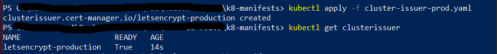
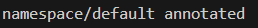

# Initial Kubernetes deployment
{: .no_toc }

> This page applies to NBS {{ site.version_latest }}. Helm chart links are pinned to `{{ site.version_latest_tag }}`.
{: .note }

This page explains how to deploy the core Kubernetes infrastructure services that NBS 7 requires before you install application components. Complete the sections in order. After you complete these steps, proceed to [Keycloak Installation](../../deploy-nbs7/keycloak/keycloak-installation.html).

## On this page
{: .no_toc .text-delta }

1. TOC
{:toc}

## Bootstrap Kubernetes

1. Download the Helm configuration package from the [CDCgov/NEDSS-Helm][nedss-helm-repo] repo on Github. Be sure to go through the [{{ site.version_latest_tag }} release page][nedss-helm-release-page] to see what's included.
1. Open a terminal (bash, macOS Terminal, CloudShell, or PowerShell) and unzip the downloaded file.
1. **All helm commands should be executed from the charts directory.** Change directory to where you unzipped the helm **charts** folder `<Helm_Dir>/charts`.

## Create secrets in your cluster

After you download and unzip the Helm configuration package, create the Kubernetes secrets that your cluster uses to connect to its databases. This section explains how to populate the `nbs-secrets.yaml` manifest with your environment-specific database credentials and deploy it to the cluster. After you complete this step, move on to deploy the Traefik ingress controller.

1. Obtain the sample Kubernetes manifest to create secrets expected to be available on the cluster from `k8-manifests/nbs-secrets.yaml`.
1. Replace string values wherever there is an `EXAMPLE_`:

   | **Parameter** | **Template Value** | **Example/Description** |
   |---|---|---|
   | odse_url | `jdbc:sqlserver://EXAMPLE_DB_ENDPOINT:1433;databaseName=EXAMPLE_ODSE_DB_NAME;encrypt=true;trustServerCertificate=true;` | `jdbc:sqlserver://mydbendpoint:1433;databaseName=nbs_odse;encrypt=true;trustServerCertificate=true;` |
   | rdb_url | `jdbc:sqlserver://EXAMPLE_DB_ENDPOINT:1433;databaseName=EXAMPLE_RDB_DB_NAME;encrypt=true;trustServerCertificate=true;` | `jdbc:sqlserver://mydbendpoint:1433;databaseName=nbs_rdb;encrypt=true;trustServerCertificate=true;` |
   | odse_user | `EXAMPLE_ODSE_DB_USER` | ODSE database user |
   | odse_pass | `EXAMPLE_ODSE_DB_USER_PASSWORD` | ODSE database password |
   | rdb_user | `EXAMPLE_RDB_DB_USER` | RDB database user |
   | rdb_pass | `EXAMPLE_RDB_DB_PASSWORD` | RDB database password |
   | srte_user | `EXAMPLE_SRTE_DB_USER` | SRTE database user |
   | srte_pass | `EXAMPLE_SRTE_DB_PASSWORD` | SRTE database password |
   | investigation_reporting_user | `EXAMPLE_INVESTIGATION_REPORTING_DB_USER` | RTR investigation reporting database user |
   | investigation_reporting_pass | `EXAMPLE_INVESTIGATION_REPORTING_DB_PASSWORD` | RTR investigation reporting database password |
   | ldfdata_reporting_user | `EXAMPLE_LDFDATA_REPORTING_DB_USER` | RTR ldfdata reporting database user |
   | ldfdata_reporting_pass | `EXAMPLE_LDFDATA_REPORTING_DB_PASSWORD` | RTR ldfdata reporting database password |
   | observation_reporting_user | `EXAMPLE_OBSERVATION_REPORTING_DB_USER` | RTR observation reporting database user |
   | observation_reporting_pass | `EXAMPLE_OBSERVATION_REPORTING_DB_PASSWORD` | RTR observation reporting database password |
   | organization_reporting_user | `EXAMPLE_ORGANIZATION_REPORTING_DB_USER` | RTR organization reporting database user |
   | organization_reporting_pass | `EXAMPLE_ORGANIZATION_REPORTING_DB_PASSWORD` | RTR organization reporting database password |
   | person_reporting_user | `EXAMPLE_PERSON_REPORTING_DB_USER` | RTR person reporting database user |
   | person_reporting_pass | `EXAMPLE_PERSON_REPORTING_DB_PASSWORD` | RTR person database password |
   | post_processing_reporting_user | `EXAMPLE_POST_PROCESSING_REPORTING_DB_USER` | RTR post processing reporting database user |
   | post_processing_reporting_pass | `EXAMPLE_POST_PROCESSING_REPORTING_DB_PASSWORD` | RTR post processing database password |

1. Deploy the secrets to the cluster:

   ```bash
   kubectl apply -f k8-manifests/nbs-secrets.yaml
   ```

   

## Deploy Traefik ingress controller

After you create and deploy your Kubernetes secrets, set up the Traefik ingress controller. This section explains how to install Traefik Custom Resource Definitions (CRDs), deploy Traefik for AWS or Azure, deploy NBS ingress resources, and create the DNS records your cluster needs to route traffic. After you complete these steps, [configure Cert Manager](#configure-cert-manager-optional) to manage TLS certificates for your cluster.

### Install Traefik CRDs

Install Traefik CRDs before installing the controller. These enable Traefik-specific resources such as IngressRoute and Middleware.

```bash
helm repo add traefik https://traefik.github.io/charts
helm repo update
helm install traefik-crds traefik/traefik-crds --namespace traefik --create-namespace
```

### Deploy the Traefik controller

The Traefik Helm charts are located in the [NEDSS-Helm repository][nedss-helm-traefik-chart]. Traefik uses the values in `charts/traefik/values.yaml` (AWS) or `charts/traefik/values-azure.yaml` (Azure) from the downloaded chart package. These values are preconfigured to set up Prometheus metrics, configure Linkerd sidecar injection, set timeouts, and instruct the Traefik controller to create an Amazon Elastic Kubernetes Service (Amazon EKS) Network Load Balancer (NLB) or Azure Kubernetes Service (AKS) internal load balancer.

1. To create the Traefik Controller within Kubernetes, choose the appropriate command for your environment:

   - **Amazon Elastic Kubernetes Service (Amazon EKS):**

   ```bash
   helm install traefik traefik/traefik --namespace traefik --create-namespace -f ./traefik/values.yaml --skip-crds
   ```

   - **Azure Kubernetes Service (AKS):**

    ```bash
    helm install traefik traefik/traefik --namespace traefik --create-namespace -f ./traefik/values-azure.yaml --skip-crds
    ```

1. Monitor the deployment status:

   ```bash
   kubectl --namespace traefik get services -o wide -w traefik
   ```

   > Use `Ctrl+C` to exit if the command is still running.
   {: .note }

1. In the AWS Management Console or Azure portal, verify that a load balancer was created and that its target groups point to the Amazon EKS or AKS cluster.
1. Confirm the Traefik pod is running. The pod should show `2/2` for the Traefik and Linkerd sidecar containers:

   ```bash
   kubectl get pods -n traefik
   ```

### Deploy NBS ingress resources

The `nbs-ingress` chart manages all NBS 7 application routing, including Keycloak, NBS Gateway, data ingestion services, and middleware. Deploy it independently of the application charts.

1. Locate the Traefik Helm charts in the [NEDSS-Helm repository][nedss-helm-traefik-chart]. Update the values in `charts/nbs-ingress/values.yaml` with your environment-specific hostnames, or pass them as `--set` flags.
1. Deploy the ingress resources:

   ```bash
   helm install nbs-ingress ./nbs-ingress -n default -f ./nbs-ingress/values.yaml
   ```

   Or with inline hostname overrides:

   ```bash
   helm install nbs-ingress ./nbs-ingress -n default \
     --set appHost=app.SITE_NAME.EXAMPLE_DOMAIN \
     --set dataHost=data.SITE_NAME.EXAMPLE_DOMAIN
   ```

1. Verify the ingress resources were created:

   ```bash
   kubectl get ingress -A
   kubectl get ingressroute -A
   kubectl get middleware -A
   ```

### Create DNS records

Create A or CNAME records in your DNS service (for example, Route 53 for Amazon EKS or Azure DNS for AKS) pointing the following subdomains to the load balancer.

1. Find the load balancer address:

   ```bash
   kubectl get svc traefik -n traefik
   ```

1. Create CNAME, A, or ALIAS records that point to the correct hostname. For Amazon EKS, `EXTERNAL-IP` is an NLB hostname (for example, `xxxxxx.elb.us-east-2.amazonaws.com`). For Azure, `EXTERNAL-IP` is an IP address.

   > NiFi has known security vulnerabilities. Only add a NiFi DNS entry if you need to administer it directly. Omit it otherwise.
   {: .warning }

   For the following example hostnames, replace `site_name.example_domain` with your site and domain names.

   | Subdomain | Template | Example |
   |---|---|---|
   | NBS application | `app.site_name.example_domain.com` | `app.fts3.nbspreview.com` |
   | Data services | `data.site_name.example_domain.com` | `data.fts3.nbspreview.com` |
   | NiFi (use with caution) | `nifi.site_name.example_domain.com` | `nifi.fts3.nbspreview.com` |

1. Verify DNS propagation:

   ```bash
   dnslookup app.SITE_NAME.EXAMPLE_DOMAIN
   ```

   The resolved address should match the Traefik load balancer.

### Verify the deployment

Open the application in a browser and verify the following:

- Keycloak login page loads with full styling (CSS, JS)
- Authentication works (login and logout)
- NBS 7 application pages load correctly
- Data ingestion endpoints respond
- Static assets load with correct caching headers

Verify response headers in browser DevTools (**F12** > **Network** tab):

- `X-Frame-Options: Allow`
- `Cross-Origin-Opener-Policy: same-origin`
- `Cache-Control: max-age=1209600, immutable` (on static assets such as `.js` and `.css` files)

### Troubleshoot Traefik

If issues persist after initial troubleshooting, contact support at <mailto:nbs@cdc.gov>.

#### Access the Traefik dashboard

The Traefik dashboard lets you inspect routers, services, and middleware:

```bash
kubectl port-forward -n traefik deployment/traefik 9000:9000
```

Open `http://localhost:9000/dashboard/` in your browser.

#### View Traefik logs

```bash
kubectl logs -n traefik deployment/traefik -c traefik --tail=100
```

#### Common Traefik issues

- **418 "I'm a Teapot" response:** No router matched the request. Verify that `ingressClassName: traefik` and the hostname match.
- **502 Bad Gateway:** The backend service is not running or there is a port mismatch. Run `kubectl get svc` and `kubectl get endpoints` to check.
- **TLS certificate errors:** Verify the TLS secret exists:

   ```bash
   kubectl get secret <secretName>
   ```

- **Traefik pod showing 1/2:** The Linkerd sidecar is not injecting. Verify `linkerd.io/inject: enabled` is set in Traefik values.
- **Traefik pod on wrong node (AKS with Windows nodes):** Add `nodeSelector: kubernetes.io/os: linux` to Traefik values.

## Configure cert-manager (optional)

cert-manager creates TLS certificates for workloads in your cluster and renews the certificates before they expire. By default, cert-manager uses [Let's Encrypt](https://letsencrypt.org/) as the certificate authority for NiFi and modernization-api services.

> If you have manual certificates, skip steps 1 - 4 and store your certificates in Kubernetes secrets instead. For more information, see the [Kubernetes Secrets documentation](https://kubernetes.io/docs/concepts/configuration/secret/).
{: .note }

1. Locate the cluster issuer manifest at [`k8-manifests/cluster-issuer-prod.yaml`][nedss-helm-cluster-issuer-manifest] in the NEDSS-Helm repository.

1. In `cluster-issuer-prod.yaml`, update the email address to a valid operations address. Let's Encrypt uses this address to notify you of upcoming certificate expirations if automatic renewal stops working.

1. Apply the manifest:

   ```bash
   cd <HELM_DIR>/k8-manifests
   kubectl apply -f cluster-issuer-prod.yaml
   ```

1. Verify the cluster issuer is deployed and in a ready state:

   ```bash
   kubectl get clusterissuer
   ```

   You should see `letsencrypt-production` with a `READY` status of `True`.

   

## Configure Linkerd and Cluster Autoscaler

### Annotate the default namespace for Linkerd

Linkerd must be installed as part of the Terraform infrastructure deployment before completing these steps. Annotating the default namespace enables Linkerd mTLS on all microservices deployed in the following steps.

1. Annotate the default namespace:

   ```bash
   kubectl annotate namespace default "linkerd.io/inject=enabled"
   ```

   

1. Verify the annotation is in place:

   ```bash
   kubectl get namespace default -o=jsonpath='{.metadata.annotations}'
   ```

   The output should include `{"linkerd.io/inject":"enabled"}`.

1. If this is an update rather than a new install, restart the application pods in the default namespace so that Linkerd sidecars are injected. Restarted pods should show `2/2` in the ready column.

### Install the Cluster Autoscaler

The Cluster Autoscaler is a Helm chart that horizontally scales cluster nodes as needed. Update the following values in `charts/cluster-autoscaler/values.yaml` with values from the AWS console:

```yaml
clusterName: <EXAMPLE_EKS_CLUSTER_NAME>
autoscalingGroups:
  - name: <EXAMPLE_AWS_AUTOSCALING_GROUP_NAME>
    maxSize: 5
    minSize: 3
awsRegion: us-east-1
```

Install the chart:

```bash
helm repo add autoscaler https://kubernetes.github.io/autoscaler
helm upgrade --install cluster-autoscaler autoscaler/cluster-autoscaler \
  -f ./cluster-autoscaler/values.yaml \
  --namespace kube-system
```

Verify the pod is running:

```bash
kubectl --namespace=kube-system get pods \
  -l "app.kubernetes.io/name=aws-cluster-autoscaler,app.kubernetes.io/instance=cluster-autoscaler"
```

[nedss-helm-repo]: <https://github.com/CDCgov/NEDSS-Helm/tree/{{ site.version_latest_tag }}>
[nedss-helm-release-page]: <https://github.com/CDCgov/NEDSS-Helm/releases/tag/{{ site.version_latest_tag }}>
[nedss-helm-traefik-chart]: <https://github.com/CDCgov/NEDSS-Helm/tree/{{ site.version_latest_tag }}/charts/traefik>
[nedss-helm-cluster-issuer-manifest]: <https://github.com/CDCgov/NEDSS-Helm/blob/{{ site.version_latest_tag }}/k8-manifests/cluster-issuer-prod.yaml>
