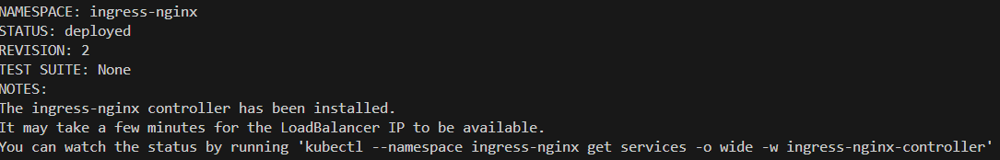

# Initial Kubernetes deployment
{: .no_toc }

This page explains how to deploy the core Kubernetes infrastructure services that NBS 7 requires before you install application components. Complete the
sections in order. After you complete these steps, proceed to [Keycloak Installation](../../../docs/deploy-nbs7/keycloak/keycloak-installation.html).

## On this page
{: .no_toc .text-delta }

1. TOC
{:toc}

## Bootstrap Kubernetes

1. Download the Helm configuration package from GitHub. Make sure you go through the release page and see what's included [Latest release of CDCgov/NEDSS-Helm](https://github.com/CDCgov/NEDSS-Helm/releases).
2. Open bash/mac/cloudshell/powershell and unzip the downloaded nbs-helm-vX.Y.Z zip file.
3. **All helm commands should be executed from the charts directory.** Change directory to where you unzipped the helm **charts** folder `<Helm_Dir>/charts`.

## Create secrets in your cluster

After you download and unzip the Helm configuration package, you need to create the Kubernetes secrets that your cluster will use to connect to its databases. This page explains how to populate the `nbs-secrets.yaml` manifest with your environment-specific database credentials and deploy it to the cluster. After you complete this step, move on to deploy the NGINX ingress controller.

1. Obtain the sample Kubernetes manifest to create secrets expected to be available on the cluster from k8-manifests/nbs-secrets.yaml.
2. Replace string values wherever there is an "EXAMPLE_"
  {: .no_toc }

  | **Parameter**                           | **Template Value**                         | **Example/Description**                      |
  |----------------------------------------|-----------------------------------------------------|--------------------------------------|
  | odse_url |"jdbc:sqlserver://EXAMPLE_DB_ENDPOINT:1433;databaseName=EXAMPLE_ODSE_DB_NAME;encrypt=true;trustServerCertificate=true;" | jdbc:sqlserver://mydbendpoint:1433;databaseName=nbs_odse;encrypt=true;trustServerCertificate=true; |
  | rdb_url |"jdbc:sqlserver://EXAMPLE_DB_ENDPOINT:1433;databaseName=EXAMPLE_RDB_DB_NAME;encrypt=true;trustServerCertificate=true;" |  jdbc:sqlserver://mydbendpoint:1433;databaseName=nbs_rdb;encrypt=true;trustServerCertificate=true; |
  | odse_user | "EXAMPLE_ODSE_DB_USER" | ODSE database user |
  | odse_pass | "EXAMPLE_ODSE_DB_USER_PASSWORD" | ODSE database password |
  | rdb_user  | "EXAMPLE_RDB_DB_USER" | RDB database user |
  | rdb_pass  | "EXAMPLE_RDB_DB_PASSWORD" | RDB database password |
  | srte_user | "EXAMPLE_SRTE_DB_USER" | SRTE database user |
  | srte_pass | "EXAMPLE_SRTE_DB_PASSWORD" | SRTE database password |
  | investigation_reporting_user | "EXAMPLE_INVESTIGATION_REPORTING_DB_USER" | RTR investiation reporting database user |
  | investigation_reporting_pass | "EXAMPLE_INVESTIGATION_REPORTING_DB_PASSWORD" | RTR investiation reporting database password |
  | ldfdata_reporting_user | "EXAMPLE_LDFDATA_REPORTING_DB_USER" | RTR ldfdata reporting database user |
  | ldfdata_reporting_pass | "EXAMPLE_LDFDATA_REPORTING_DB_PASSWORD" | RTR ldfdata reporting database password |
  | observation_reporting_user | "EXAMPLE_OBSERVATION_REPORTING_DB_USER" | RTR observation reporting database user |
  | observation_reporting_pass | "EXAMPLE_OBSERVATION_REPORTING_DB_PASSWORD" | RTR observation reporting database password |
  | organization_reporting_user | "EXAMPLE_ORGANIZATION_REPORTING_DB_USER" | RTR organiztion reporting  database user |
  | organization_reporting_pass | "EXAMPLE_ORGANIZATION_REPORTING_DB_PASSWORD" | RTR organization reporting database password |
  | person_reporting_user | "EXAMPLE_PERSON_REPORTING_DB_USER" | RTR person reporting database user |
  | person_reporting_pass | "EXAMPLE_PERSON_REPORTING_DB_PASSWORD" | RTR person database password |
  | post_processing_reporting_user | "EXAMPLE_POST_PROCESSING_REPORTING_DB_USER" | RTR post processing reporting database user |
  | post_processing_reporting_pass | "EXAMPLE_POST_PROCESSING_REPORTING_DB_PASSWORD" | RTR post processing database password |

3. Deploy the secrets to the cluster.

```bash
kubectl apply -f k8-manifests/nbs-secrets.yaml
```


## Deploy NGINX ingress controller on your cluster

After you create and deploy your Kubernetes secrets, set up the NGINX ingress controller. This page explains how to use the preconfigured Helm values to install the controller, verify that the AWS network load balancer is active, and create the DNS records your cluster needs to route traffic. After you complete these steps, configure Cert Manager to manage TLS certificates for your cluster.

### Install the NGINX ingress controller

The values in `charts/nginx-ingress/values.yaml` (part of the `nbs-helm-vX.Y.Z` zip file) are preconfigured to set up Prometheus metrics scraping and to instruct the NGINX controller to create an AWS network load balancer instead of a classic load balancer.

1. Install the NGINX ingress controller:

   ```bash
   helm upgrade --install ingress-nginx ingress-nginx --repo https://kubernetes.github.io/ingress-nginx -f ./nginx-ingress/values.yaml --namespace ingress-nginx --create-namespace --version 4.11.5
   ```

   

1. Monitor the deployment status:

   ```bash
   kubectl --namespace ingress-nginx get services -o wide -w ingress-nginx-controller
   ```

   > Use `Ctrl+C` to exit if the command is still running.
   {: .note }

1. In the [AWS load balancers console](https://us-east-1.console.aws.amazon.com/ec2/home?region=us-east-1#LoadBalancers:), confirm a network load balancer was created and its target groups point to the EKS cluster.

1. Confirm at least one NGINX controller pod is running:

   ```bash
   kubectl get pods -n=ingress-nginx
   ```

### Create DNS records

Create A records in your DNS service (for example, Route 53) pointing the following subdomains to the active network load balancer provisioned above. Replace `example_domain.com` with your domain name.

> NiFi has known security vulnerabilities. Only add a NiFi DNS entry if you need to administer it directly. Omit it otherwise.
{: .warning }

| Subdomain | Template | Example |
|---|---|---|
| NBS (main domain) | `site_name.example_domain.com` | `fts3.nbspreview.com` |
| NBS 6 (classic) | `app-classic.site_name.example_domain.com` | `app-classic.fts3.nbspreview.com` |
| NBS 7 (modern) | `app.site_name.example_domain.com` | `app.fts3.nbspreview.com` |
| NiFi (optional) | `nifi.site_name.example_domain.com` | `nifi.fts3.nbspreview.com` |
| Data Ingestion | `data.site_name.example_domain.com` | `data.fts3.nbspreview.com` |

## Configure cert-manager (optional)

cert-manager creates TLS certificates for workloads in your cluster and renews the certificates before they expire. By default, cert-manager uses [Let's Encrypt](https://letsencrypt.org/) as the certificate authority for NiFi and modernization-api services.

> If you have manual certificates, skip steps 1-4 below and store your certificates in Kubernetes secrets instead. For more information, see the [Kubernetes Secrets documentation](https://kubernetes.io/docs/concepts/configuration/secret/).
{: .note }

1. Locate the cluster issuer manifest in the `nbs-helm-v7.X.0` zip file at `k8-manifests/cluster-issuer-prod.yaml`.

1. In `cluster-issuer-prod.yaml`, update the email address to a valid operations address. Let's Encrypt uses this address to notify you of upcoming certificate expirations if automatic renewal stops working.

1. From your terminal, apply the manifest:

   ```bash
   cd <HELM_DIR>/k8-manifests
   kubectl apply -f cluster-issuer-prod.yaml
   ```

1. Verify the cluster issuer is deployed and in a ready state:

   ```bash
   kubectl get clusterissuer
   ```

   You should see `letsencrypt-production` with a `READY` status of `True`.

   

## Configure Linkerd and Cluster Autoscaler

### Annotate the default namespace for Linkerd

Linkerd must be installed as part of the Terraform infrastructure deployment before completing these steps. Annotating the default namespace enables Linkerd mTLS on all microservices deployed in the following steps.

1. Annotate the default namespace:

   ```bash
   kubectl annotate namespace default "linkerd.io/inject=enabled"
   ```

   

1. Verify the annotation is in place:

   ```bash
   kubectl get namespace default -o=jsonpath='{.metadata.annotations}'
   ```

   The output should include `{"linkerd.io/inject":"enabled"}`.

1. If this is an update rather than a new install, restart the application pods in the default namespace so that Linkerd sidecars are injected. Restarted pods should show `2/2` in the ready column.

### Install the Cluster Autoscaler

The Cluster Autoscaler is a Helm chart that horizontally scales cluster nodes as needed. Update the following values in `charts/cluster-autoscaler/values.yaml` with values from the AWS console:

```yaml
clusterName: <EXAMPLE_EKS_CLUSTER_NAME>
autoscalingGroups:
  - name: <EXAMPLE_AWS_AUTOSCALING_GROUP_NAME>
    maxSize: 5
    minSize: 3
awsRegion: us-east-1
```

Install the chart:

```bash
helm repo add autoscaler https://kubernetes.github.io/autoscaler
helm upgrade --install cluster-autoscaler autoscaler/cluster-autoscaler \
  -f ./cluster-autoscaler/values.yaml \
  --namespace kube-system
```

Verify the pod is running:

```bash
kubectl --namespace=kube-system get pods \
  -l "app.kubernetes.io/name=aws-cluster-autoscaler,app.kubernetes.io/instance=cluster-autoscaler"
```
