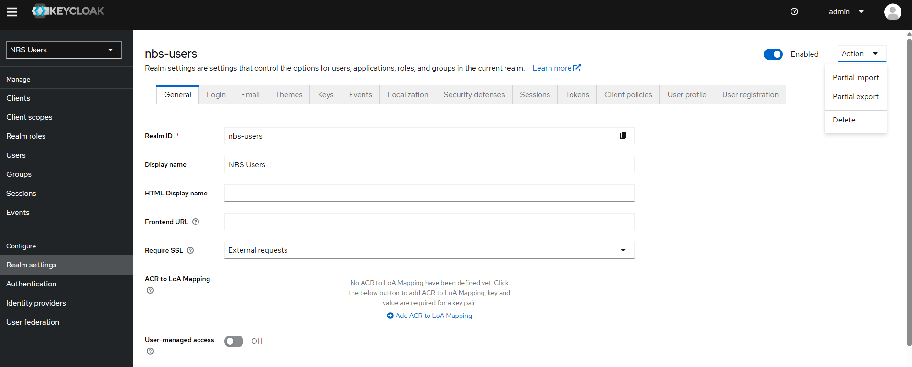

# Enable Keycloak authentication
{: .no_toc }

After installing Keycloak, complete the steps on this page to configure authentication for NBS 7. This page covers realm and user setup, retrieving the client secret you will need during microservices deployment, and optionally setting a login theme.

## On this page
{: .no_toc .text-delta }

1. TOC
{:toc}

## Verify Keycloak is running

Before you begin, confirm that Keycloak is running and accessible.

1. Confirm the Keycloak pod is running:

   ```bash
   kubectl get pods
   ```

1. Set up port forwarding:

   ```bash
   kubectl --namespace default port-forward "<pod_name>" 8080
   ```

1. Open `http://localhost:8080/auth/` in a browser and log in to the Keycloak web UI as an admin.

## Create the NBS realm

Create the NBS realm that Keycloak uses to manage NBS users and clients. The steps below use files from the [charts/keycloak/extra/][nedss-helm-keycloak-extra] directory in the NEDSS-Helm repository.

1. From the side navigation bar, select **Create realm**.

   

1. Upload `charts/keycloak/extra/02-nbs-users-realm.json` and select **Create**.

   

1. Verify the new realm, **nbs-users**, appears in the realm list.

   

## Import base users and clients

Import the base NBS users and development clients into the realm you created.

1. Select the **nbs-users** realm, then go to **Realm settings** > **Action** > **Partial Import**.

   

1. Upload `charts/keycloak/extra/03-nbs-users-base-users.json`, select the three users, and select **Import**.

   
   
1. Upload `charts/keycloak/extra/04-nbs-users-development-clients.json`, select the one client, and select **Import**.

   
   

## Configure the NBS gateway

Retrieve the Keycloak client secret for the NBS gateway. You will use this value when you deploy the `nbs-gateway` microservice.

> OIDC must be enabled when deploying `modernization-api` and `nbs-gateway`. You configure OIDC during microservices deployment, not on this page.
{: .note }

1. In the **nbs-users** realm, go to **Clients** > **nbs-modernization** > **Credentials** > **Client Secret**.

   
1. Copy the client secret. You will use this value when setting `oidc.client.secret` in `charts/nbs-gateway/values.yaml` during microservices deployment.

## Set the login theme

This step is optional. You can use the pre-populated NBS login theme, keep the default Keycloak theme, or create a custom theme. The Keycloak Helm chart loads a sample NBS theme in a persistent volume mounted at `/opt/keycloak/themes/nbs`.

1. Select the **nbs-users** realm.
1. Go to **Realm settings** > **Themes** > **Login** and select your preferred theme.

   

[nedss-helm-keycloak-extra]: <https://github.com/CDCgov/NEDSS-Helm/tree/{{ site.version_latest_tag }}/charts/keycloak/extra/>
