# Keycloak Installation
{: .no_toc }

## On this page
{: .no_toc .text-delta }

1. TOC
{:toc}

The Keycloak Helm chart provides authentication for `modernization-api`, `nbs-gateway`, `data-ingestion-api`, and `nnd`. Locate the chart in the [NEDSS-Helm repository][nedss-helm-keycloak-chart] before beginning.

## Create the Keycloak database

> Any compatible SQL client can be used, including SQL Server Management Studio (SSMS).
{: .note }

1. Using your SQL client, authenticate into the RDS instance where NBS is running:
   - **DB Endpoint** – DB Endpoint
   - **Username** – `admin`
   - **Password** – `database_admin_password`

1. Run the script below (from [nbs_keycloak.sql][nedss-helm-keycloak-sql] in the NEDSS-Helm repository) to create the Keycloak database and database user. Replace `'EXAMPLE_KCDB_PASS8675309'` with a complex password that meets your organization's standards. Store this password securely — you will need it in the `values.yaml` file in the next section.

   ```bash
   use master
     IF NOT EXISTS(SELECT * FROM sys.databases WHERE name = 'keycloak')
     BEGIN
       CREATE DATABASE keycloak
    END
   GO
     USE keycloak
   GO

   BEGIN
   CREATE LOGIN NBS_keycloak WITH PASSWORD = 'EXAMPLE_KCDB_PASS8675309';
   CREATE USER NBS_keycloak FOR LOGIN NBS_keycloak;
   EXEC sp_addrolemember N'db_owner', N'NBS_keycloak'
   END
   ```

   **Validation: Keycloak database is created**

   

## Configure the Helm chart

1. In [values.yml][nedss-helm-keycloak-values], update the following parameters:

   | **Parameter** | **Template Value** | **Example / Description** |
   |---|---|---|
   | adminUser | admin | Keycloak admin account for the Web UI. Keep the template value or change to match organizational naming conventions. |
   | adminPassword | EXAMPLE_KC_PASS8675309 | Password for the Keycloak admin user. Use a complex password matching organizational standards. |
   | KC_DB | mssql | mssql |
   | KC_DB_URL | jdbc:sqlserver://EXAMPLE_DB_ENDPOINT:1433;databaseName=keycloak;encrypt=true;trustServerCertificate=true; | jdbc:sqlserver://mydbendpoint:1433;databaseName=keycloak;encrypt=true;trustServerCertificate=true; |
   | KC_DB_USERNAME | NBS_keycloak | Keycloak database account. Keep the template value or change to match organizational naming conventions. |
   | KC_DB_PASSWORD | EXAMPLE_KCDB_PASS8675309 | Must match the password set in step 2 of the previous section. |
   | efsFileSystemId | EXAMPLE_EFS_ID | EFS file system ID from the AWS console or CLI. Provides persistent storage for themes. |

## Deploy Keycloak

1. Authenticate to the Amazon EKS cluster:

   ```bash
   aws eks --region us-east-1 update-kubeconfig --name <clustername> # e.g. cdc-nbs-sandbox
   ```

1. From the charts directory, install the Keycloak Helm chart. This step takes at least 5 minutes while the init container becomes available. See the [README in `charts/keycloak`][nedss-helm-keycloak-chart] for details.

   ```bash
   Helm install keycloak --namespace default -f keycloak/values.yaml keycloak
   ```

   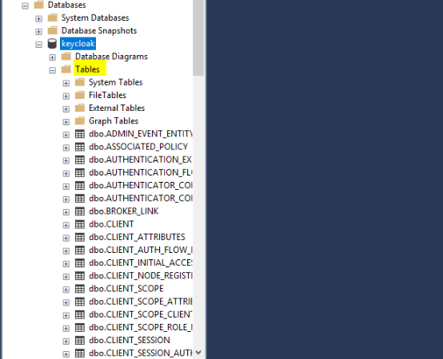

1. Verify the pod is running before proceeding:

   ```bash
   kubectl get pods -n default
   ```

## Access the Keycloak admin interface

> Port forwarding is not supported by CloudShell by default. Run these commands from a system that has both network access to the Amazon EKS endpoint and a browser. If you completed the installation from CloudShell, switch to a jumpbox or desktop with network connectivity to the Amazon EKS endpoint.
{: .note }

1. Set up port forwarding:

   ```bash
   export POD_NAME=$(kubectl get pods --namespace default -o name);
   echo "Visit http://127.0.0.1:8080/auth to use your application";
   kubectl --namespace default port-forward "$POD_NAME" 8080;
   ```

1. In a browser, navigate to <http://127.0.0.1:8080/auth> and select **Administrative console**.

   

1. Sign in using the `adminUser` and `adminPassword` values configured in the Helm chart.

   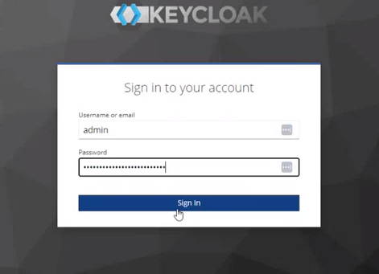
   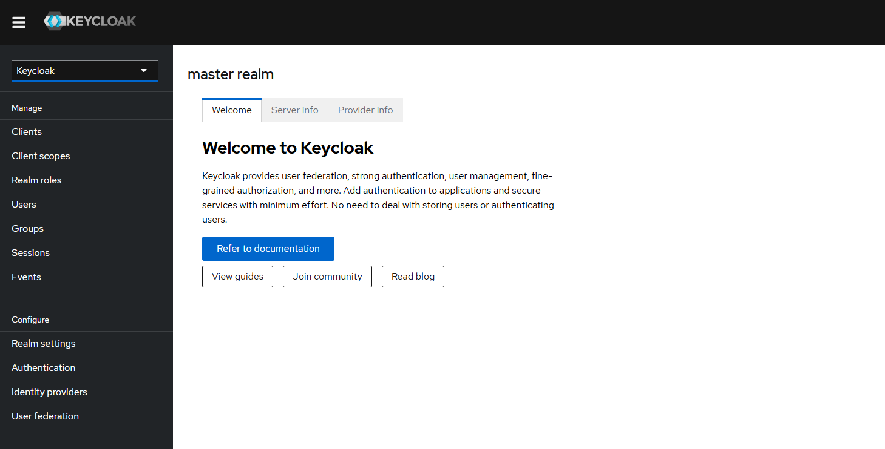

## Create the NBS realm

1. Create a new realm to contain the NBS-specific client and user/group configurations.

   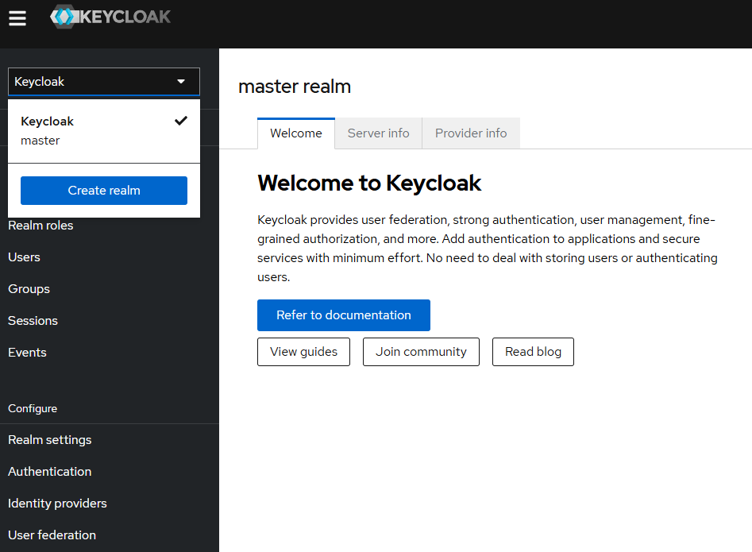

1. Upload [01-NBS-realm-with-DI-client.json][nedss-helm-keycloak-di-client] and click **Create**. This imports the NBS realm and clients.

   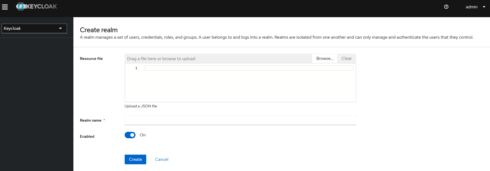
   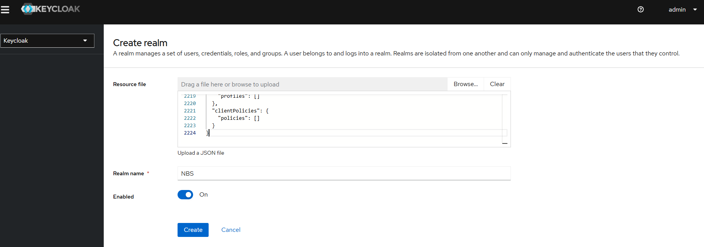

1. Verify the realm and clients are created successfully.

   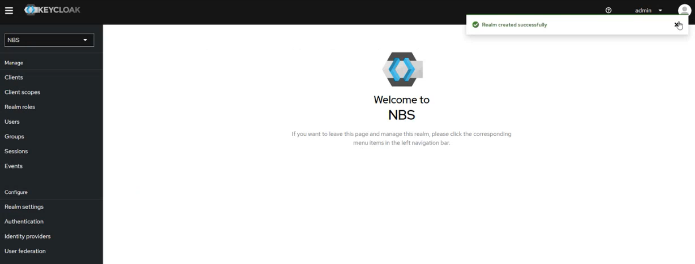

## Configure service clients

The imported configuration seeds a random client secret for each service client. You may regenerate or use a secure local client secret. Repeat the import and retrieval steps below for each client.

### DI client

1. Navigate to the **NBS Realm** in the left menu and click **Clients**.
1. Select `di-keycloak-client` and open the **Credentials** tab.
1. Click the eye icon to reveal the secret and copy it.
1. Store the secret for use by the applications (for example, in AWS Secrets Manager at `keycloak/client/secret/di`).

   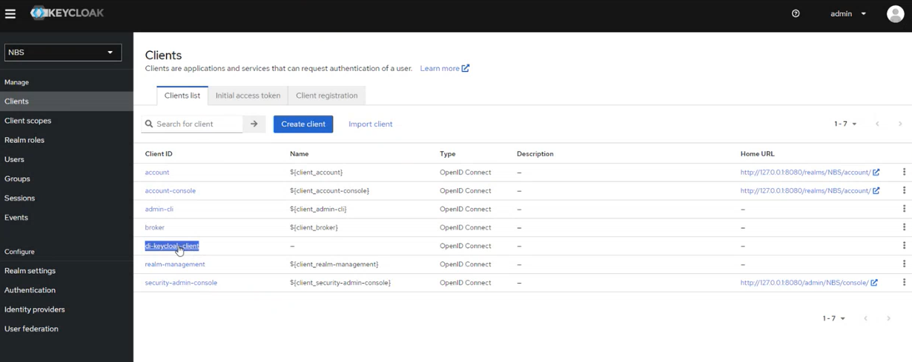
   

### NND client

1. In the **NBS Realm**, open **Realm settings**, click the **Action** dropdown, and select **Partial Import**.

   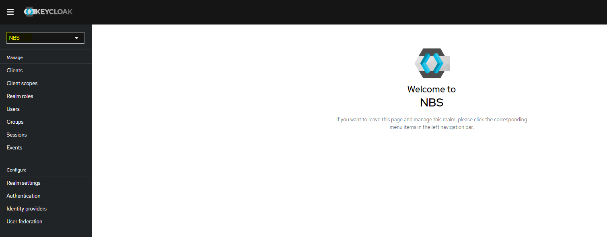
   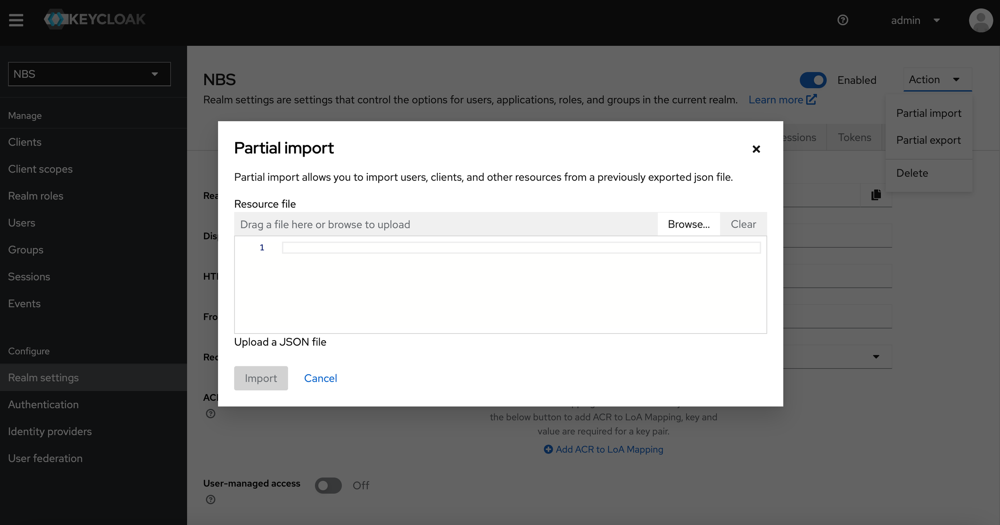

1. Upload [05-nbs-users-nnd-client.json][nedss-helm-keycloak-nnd-client] and click **Create**.
1. Navigate to the **NBS Realm** in the left menu and click **Clients**.
1. Select `nnd-keycloak-client` and open the **Credentials** tab.
1. Click the eye icon to reveal the secret and copy it.
1. Store the secret (for example, in AWS Secrets Manager at `keycloak/client/secret/nnd`).

   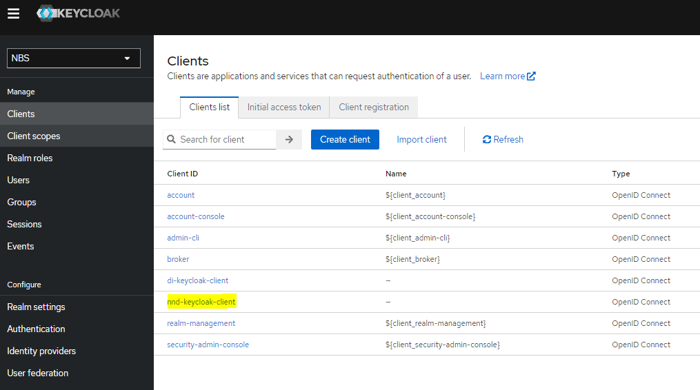
   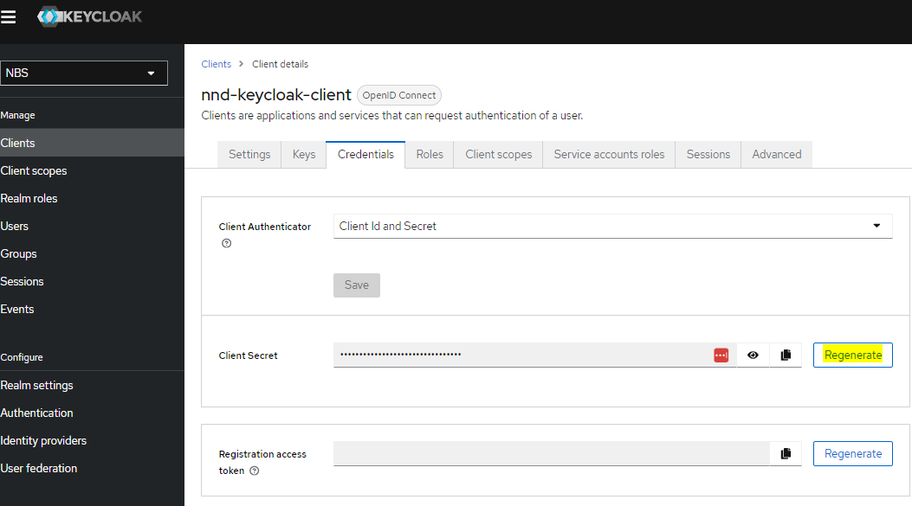

### SRTE client

1. In the **NBS Realm**, open **Realm settings**, click the **Action** dropdown, and select **Partial Import**.
1. Upload [06-nbs-users-srte-data-client.json][nedss-helm-keycloak-srte-client] and click **Create**.
1. Navigate to the **NBS Realm** in the left menu and click **Clients**.
1. Select `srte-data-keycloak-client` and open the **Credentials** tab.
1. Click the eye icon to reveal the secret and copy it.
1. Store the secret (for example, in AWS Secrets Manager at `keycloak/client/secret/srte`).

### XML-HL7 parser client

1. In the **NBS Realm**, open **Realm settings**, click the **Action** dropdown, and select **Partial Import**.
1. Upload [10-nbs-users-xml-hl7-parser-service.json][nedss-helm-keycloak-hl7-parser] and click **Create**.
1. Navigate to the **NBS Realm** in the left menu and click **Clients**.
1. Select `xml-hl7-parser-keycloak-client` and open the **Credentials** tab.
1. Click the eye icon to reveal the secret and copy it.
1. Store the secret (for example, in AWS Secrets Manager at `keycloak/client/secret/xml-hl7-parser`).

[nedss-helm-keycloak-chart]: <https://github.com/CDCgov/NEDSS-Helm/tree/{{ site.version_latest_tag }}/charts/keycloak>
[nedss-helm-keycloak-sql]: <https://github.com/CDCgov/NEDSS-Helm/blob/{{ site.version_latest_tag }}/charts/keycloak/nbs_keycloak.sql>
[nedss-helm-keycloak-values]: <https://github.com/CDCgov/NEDSS-Helm/blob/{{ site.version_latest_tag }}/charts/keycloak/values.yml>
[nedss-helm-keycloak-di-client]: <https://github.com/CDCgov/NEDSS-Helm/blob/{{ site.version_latest_tag }}/charts/keycloak/extra/01-NBS-realm-with-DI-client.json>
[nedss-helm-keycloak-nnd-client]: <https://github.com/CDCgov/NEDSS-Helm/blob/{{ site.version_latest_tag }}/charts/keycloak/extra/05-nbs-users-nnd-client.json>
[nedss-helm-keycloak-srte-client]: <https://github.com/CDCgov/NEDSS-Helm/blob/{{ site.version_latest_tag }}/charts/keycloak/extra/06-nbs-users-srte-data-client.json>
[nedss-helm-keycloak-hl7-parser]: <https://github.com/CDCgov/NEDSS-Helm/blob/{{ site.version_latest_tag }}/charts/keycloak/extra/10-nbs-users-xml-hl7-parser-service.json>
