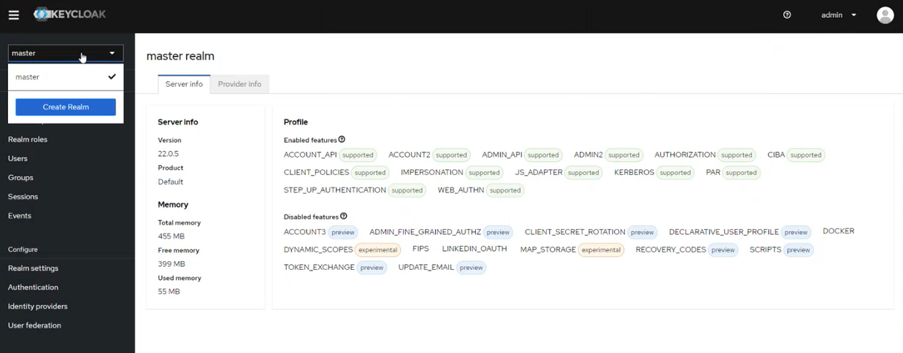
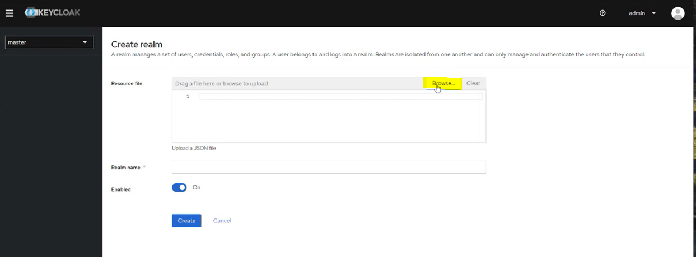
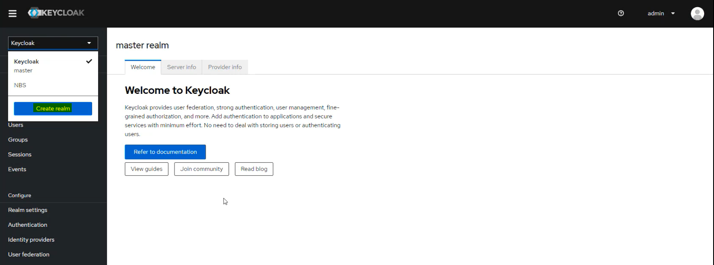
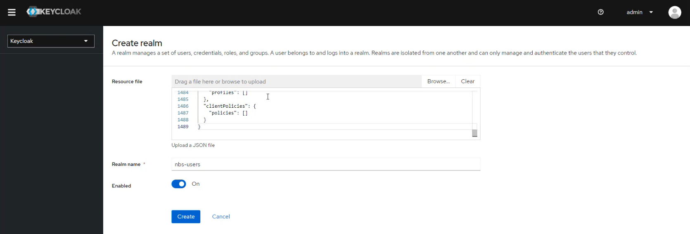
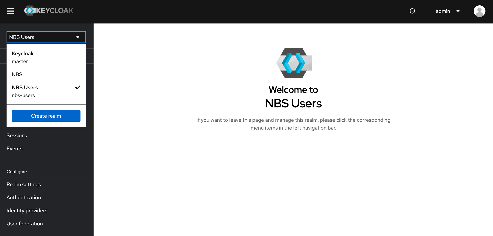
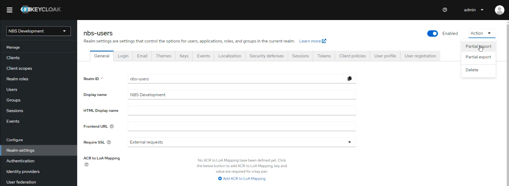
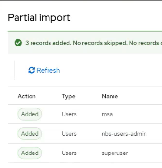
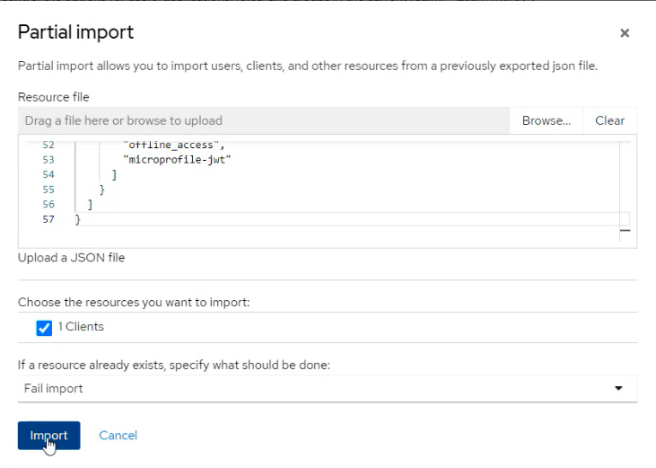
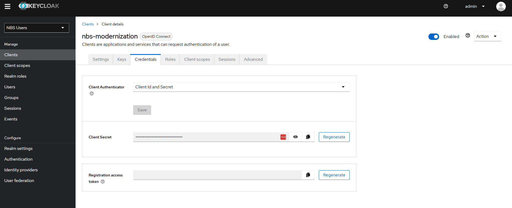
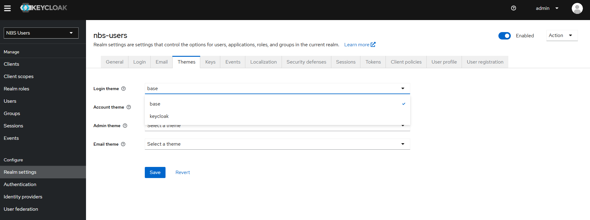

# Install Keycloak
{: .no_toc }

This page walks through installing Keycloak and configuring the authentication setup that NBS 7 microservices require. Complete these steps before you deploy NBS 7 microservices.

## On this page
{: .no_toc .text-delta }

1. TOC
{:toc}

## Overview

Keycloak provides authentication for `modernization-api`, `nbs-gateway`, `dataingestion-service`, and `nnd-service`. It uses two separate realms:

- **NBS** realm — contains service clients for data ingestion, NND, and SRTE data access.
- **nbs-users** realm — contains the user-facing authentication client used by the NBS gateway and the NBS application.

Both realms are created in [Create the NBS and nbs-users realms](#create-the-nbs-and-nbs-users-realms).

Locate the Keycloak Helm chart in the [NEDSS-Helm repository][nedss-helm-keycloak-chart] before you begin.

## Create the Keycloak database

Create the Keycloak database and database user before you deploy the Helm chart.

> Any compatible SQL client works for this step, including SQL Server Management Studio (SSMS).
{: .note }

1. Using your SQL client, authenticate into your database server:

   | Field | Value |
   |---|---|
   | DB Endpoint | Your database endpoint |
   | Username | `admin` |
   | Password | Your database admin password |

1. Run the following script (also available as [nbs_keycloak.sql][nedss-helm-keycloak-sql] in the NEDSS-Helm repository) to create the Keycloak database and database user. Replace `'EXAMPLE_KCDB_PASS8675309'` with a complex password that meets your organization's standards. Store this password — you will need it in `values.yml` in the next section.

   ```sql
   use master
     IF NOT EXISTS(SELECT * FROM sys.databases WHERE name = 'keycloak')
     BEGIN
       CREATE DATABASE keycloak
    END
   GO
     USE keycloak
   GO

   BEGIN
   CREATE LOGIN NBS_keycloak WITH PASSWORD = 'EXAMPLE_KCDB_PASS8675309';
   CREATE USER NBS_keycloak FOR LOGIN NBS_keycloak;
   EXEC sp_addrolemember N'db_owner', N'NBS_keycloak'
   END
   ```

   The following screenshot shows the keycloak database created under **Databases** in SQL Server Management Studio, confirming the script ran successfully.

   

## Configure the Helm chart

1. In [values.yml][nedss-helm-keycloak-values], update the following parameters:

   | Parameter | Template value | Description |
   |---|---|---|
   | `adminUser` | `admin` | Keycloak admin account for the web UI. Keep the template value or change it to match your organization's naming conventions. |
   | `adminPassword` | `EXAMPLE_KC_PASS8675309` | Password for the Keycloak admin user. Use a complex password that meets your organization's standards. |
   | `KC_DB` | `mssql` | Database type. Keep the template value. |
   | `KC_DB_URL` | `jdbc:sqlserver://EXAMPLE_DB_ENDPOINT:1433;databaseName=keycloak;encrypt=true;trustServerCertificate=true;` | Replace `EXAMPLE_DB_ENDPOINT` with your database endpoint. |
   | `KC_DB_USERNAME` | `NBS_keycloak` | Keycloak database account. Keep the template value or change it to match your organization's naming conventions. |
   | `KC_DB_PASSWORD` | `EXAMPLE_KCDB_PASS8675309` | Must match the password you set in the previous section. |
   <!-- markdownlint-disable MD058 -->
   <div class="three-column-values-table" markdown="1">

   | `efsFileSystemId` | `EXAMPLE_EFS_ID` | **In AWS deployments:** The Amazon EFS file system ID from the AWS console or CLI. Provides persistent storage for themes. **In Azure deployments:** Azure Files requires different configuration. See [Deploy on Azure](../deploy-on-azure.html) for Azure file storage configuration. |

   </div>
   <!-- markdownlint-enable MD058 -->

## Deploy Keycloak

Install the Keycloak Helm chart and verify the pod is running before you continue.

1. Authenticate to your Kubernetes cluster:

   <div class="code-example" markdown="1">

   **Amazon Elastic Kubernetes Service (Amazon EKS):**

   ```bash
   aws eks --region us-east-1 update-kubeconfig --name <clustername>
   ```

   **Azure Kubernetes Service (AKS):**

   ```bash
   az aks get-credentials --resource-group <resource-group> --name <clustername>
   ```

   </div>

1. From the `charts` directory, install the Keycloak Helm chart. This step takes at least 5 minutes while the init container becomes available. See the [README in `charts/keycloak`][nedss-helm-keycloak-chart] for details.

   ```bash
   helm install keycloak --namespace default -f keycloak/values.yml keycloak
   ```

   After installation completes, the Keycloak database populates with its application tables, as shown in the following screenshot.

   

1. Verify the pod is running before you continue:

   ```bash
   kubectl get pods -n default
   ```

## Access the Keycloak admin interface
{: #access-the-keycloak-admin-interface }

Use port forwarding to access the Keycloak web UI from your local machine.

> Port forwarding is not supported by CloudShell by default. Run these commands from a system that has both network access to your Kubernetes cluster endpoint and a browser. If you completed the installation from CloudShell, switch to a jumpbox or desktop with network connectivity to your cluster endpoint.
{: .important }

1. Set up port forwarding:

   ```bash
   export POD_NAME=$(kubectl get pods --namespace default -o name);
   echo "Visit http://127.0.0.1:8080/auth to use your application";
   kubectl --namespace default port-forward "$POD_NAME" 8080;
   ```

1. In a browser, go to `http://127.0.0.1:8080/auth` and select **Administrative console**.

   

   > **Image filename note:** `kyecloak-login.png` contains a typo in the filename. Do not rename this file without also updating the reference in the repository.
   {: .note }

1. Sign in using the `adminUser` and `adminPassword` values you configured in the Helm chart.

   

   After you sign in, the admin console opens to the **master** realm welcome page.

   

## Create the NBS and nbs-users realms

Keycloak uses two realms for NBS 7: the **NBS** realm for service clients, and the **nbs-users** realm for user-facing authentication. Create both using the same procedure, with a different import file for each.

| Realm | Import file | Purpose |
|---|---|---|
| NBS | [`01-NBS-realm-with-DI-client.json`][nedss-helm-keycloak-di-client] | Contains service clients for data ingestion, NND, and SRTE data access. Seeds the `di-keycloak-client` service client in the same step. |
| nbs-users | [`02-nbs-users-realm.json`][nedss-helm-keycloak-nbs-users-realm] | Provides user-facing authentication for the NBS application and NBS gateway. Contains the client used by `modernization-api` and `nbs-gateway` for OIDC login. |

> OIDC must be enabled when you deploy `modernization-api` and `nbs-gateway`. You configure OIDC during microservices deployment, not on this page. See [Deploy NBS 7 microservices](../microservices-deployment/deploy-nbs7-microservices.html) for OIDC configuration steps.
{: .note }

1. From the side navigation, select **Create** realm.
1. Upload the import file for the realm you're creating, then select **Create**. The **Realm name** field auto-populates after upload.
1. Verify the realm and its clients are created successfully.

The following screenshots show this procedure for the **NBS** realm.






The procedure is the same for the **nbs-users** realm. The following screenshots show the import with `02-nbs-users-realm.json` uploaded.







## Configure service clients

The imported configuration seeds a random client secret for each service client. You can regenerate these secrets or use them as generated. Retrieve and store each secret before you proceed to microservices deployment.

The NBS realm contains four service clients. `di-keycloak-client` is seeded with the initial realm import; the remaining three require a separate import step before you can retrieve their secrets.

| Client | Import file | Used by |
|---|---|---|
| `di-keycloak-client` | Imported with the NBS realm — no separate import needed | Data ingestion service |
| `nnd-keycloak-client` | [`05-nbs-users-nnd-client.json`][nedss-helm-keycloak-nnd-client] | NND service |
| `srte-data-keycloak-client` | [`06-nbs-users-srte-data-client.json`][nedss-helm-keycloak-srte-client] | SRTE data access |
| `case-notification-service` | [`09-nbs-users-case-notification-service.json`][nedss-helm-keycloak-case-notification-client] | Case notification service |

### Retrieve a client secret

Use the following steps to retrieve the secret for any of the four service clients in the table.

1. In the **NBS** realm, go to **Clients** and select the client.
1. Open the **Credentials** tab.
1. Select the eye icon to reveal the secret and copy it.
1. Store the secret securely in your organization's secrets manager.

The following screenshots show this procedure for `di-keycloak-client`. The **Credentials** tab looks the same for the other two clients, with the client-specific secret shown in the same field.


### Import additional service clients

The following clients are not included in the initial **NBS** realm import and require a separate Partial Import step before you can retrieve their secrets:

| Client | Import file | Used by |
|---|---|---|
| `nnd-keycloak-client` | [`05-nbs-users-nnd-client.json`][nedss-helm-keycloak-nnd-client] | NND service |
| `srte-data-keycloak-client` | [`06-nbs-users-srte-data-client.json`][nedss-helm-keycloak-srte-client] | SRTE data access |
| `case-notification-service` | [`09-nbs-users-case-notification-service.json`][nedss-helm-keycloak-case-notification-client] | Case notification service |

For each client, complete the following steps:

1. In the **NBS** realm, go to **Realm settings**, select the **Action** dropdown, and select **Partial Import**.

   

   Selecting **Partial Import** opens the following dialog, overlaying the **Realm settings** page, where you upload the client JSON file.

   

1. Upload the import file for the client and select **Import**.

After each import completes, follow [Retrieve a client secret](#retrieve-a-client-secret) to get the secret for that client.

## Import base users and clients

Import the base NBS users and development clients into the **nbs-users** realm.

1. Select the **nbs-users** realm, then go to **Realm settings** > **Action** > **Partial Import**.

   

1. Upload [`03-nbs-users-base-users.json`][nedss-helm-keycloak-extra], select the three users, and select **Import**.

   The Partial import dialog shows the file uploaded with the three users selected for import.

   

   After the import completes, Keycloak confirms that all three users were added.

   

1. Upload [`04-nbs-users-development-clients.json`][nedss-helm-keycloak-extra], select the one client, and select **Import**.

   The Partial import dialog shows the development client file uploaded and selected for import.

   

   After the import completes, Keycloak confirms that the client was added.

   

## Retrieve the nbs-modernization client secret

The `nbs-modernization` client in the **nbs-users** realm is used for OIDC login authentication across NBS 7 microservices, including `modernization-api` and `nbs-gateway`. Retrieve its secret to set the `oidc.client.secret` value when you deploy these microservices.

1. In the **nbs-users** realm, go to **Clients** and select `nbs-modernization`.
1. Open the **Credentials** tab and copy the **Client Secret**.

   

1. Store this value securely — you will use it when setting `oidc.client.secret` in the values files for `modernization-api`, `nbs-gateway`, and other NBS 7 microservices that use OIDC login during microservices deployment.

## Set the login theme (optional)

You can use the pre-populated NBS login theme, keep the default Keycloak theme, or create a custom theme. The Keycloak Helm chart loads a sample NBS theme in a persistent volume mounted at `/opt/keycloak/themes/nbs`.

1. Select the **nbs-users** realm.
1. Go to **Realm settings** > **Themes** > **Login** and select your preferred theme.

   

[nedss-helm-keycloak-chart]: <https://github.com/CDCgov/NEDSS-Helm/tree/{{ site.version_latest_tag }}/charts/keycloak>
[nedss-helm-keycloak-sql]: <https://github.com/CDCgov/NEDSS-Helm/blob/{{ site.version_latest_tag }}/charts/keycloak/nbs_keycloak.sql>
[nedss-helm-keycloak-values]: <https://github.com/CDCgov/NEDSS-Helm/blob/{{ site.version_latest_tag }}/charts/keycloak/values.yml>
[nedss-helm-keycloak-di-client]: <https://github.com/CDCgov/NEDSS-Helm/blob/{{ site.version_latest_tag }}/charts/keycloak/extra/01-NBS-realm-with-DI-client.json>
[nedss-helm-keycloak-nnd-client]: <https://github.com/CDCgov/NEDSS-Helm/blob/{{ site.version_latest_tag }}/charts/keycloak/extra/05-nbs-users-nnd-client.json>
[nedss-helm-keycloak-srte-client]: <https://github.com/CDCgov/NEDSS-Helm/blob/{{ site.version_latest_tag }}/charts/keycloak/extra/06-nbs-users-srte-data-client.json>
[nedss-helm-keycloak-nbs-users-realm]: <https://github.com/CDCgov/NEDSS-Helm/blob/{{ site.version_latest_tag }}/charts/keycloak/extra/02-nbs-users-realm.json>
[nedss-helm-keycloak-extra]: <https://github.com/CDCgov/NEDSS-Helm/tree/{{ site.version_latest_tag }}/charts/keycloak/extra/>
[nedss-helm-keycloak-case-notification-client]: <https://github.com/CDCgov/NEDSS-Helm/blob/{{ site.version_latest_tag }}/charts/keycloak/extra/09-nbs-users-case-notification-service.json>
