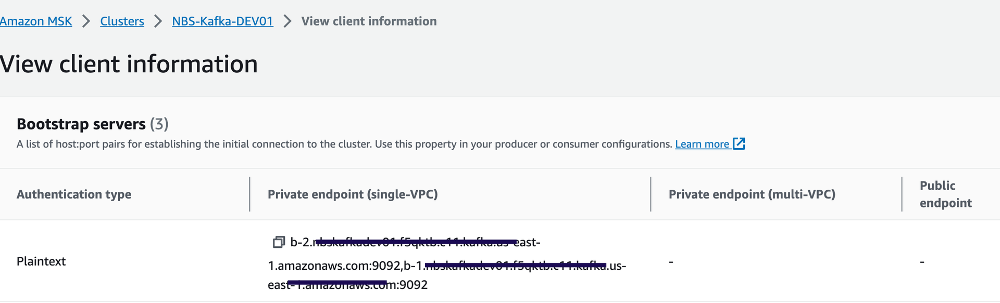

# Deploy the Data Ingestion service for NBS 7

This page walks through deploying the Data Ingestion service, including database setup and Helm chart installation.

## On this page
{: .no_toc .text-delta }

1. TOC
{:toc}

## Before you begin

The DataIngestion service utilizes three databases: NBS_Msgoute, NBS_ODSE and NBS_DataIngest.
NBS_DataIngest is a new database essential for ingesting, validating Electronic Lab Reports (ELR), converting them into XML payloads, and integrating these XMLs into the NBS_MSGOUT database. It must be created before deploying the app on the Amazon EKS cluster.

### Create the NBS_DataIngest database

Run the following SQL scripts before deploying the Data Ingestion service.

1. Create the database:

   ```sql
   IF NOT EXISTS(SELECT * FROM sys.databases WHERE name = 'NBS_DataIngest')
   BEGIN
       CREATE DATABASE NBS_DataIngest
   END
   GO
   USE NBS_DataIngest
   GO
   ```

1. Grant permissions for the `nbs_ods` user:

   ```sql
   USE [NBS_DataIngest]
   GO
   CREATE USER [nbs_ods] FOR LOGIN [nbs_ods]
   GO
   USE [NBS_DataIngest]
   GO
   ALTER USER [nbs_ods] WITH DEFAULT_SCHEMA=[dbo]
   GO
   USE [NBS_DataIngest]
   GO
   ALTER ROLE [db_owner] ADD MEMBER [nbs_ods]
   GO
   ```

### Liquibase

- Data Ingestion includes a built-in Liquibase integration that automatically applies database schema changes on deployment.
  - DB changes detail can be reviewed here:
    - **DI Liquibase:** [NEDSS-DataIngestion/data-ingestion-service/src/main/resources/db at {{ site.version_latest_tag }} · CDCgov/NEDSS-DataIngestion](https://github.com/CDCgov/NEDSS-DataIngestion/tree/{{ site.version_latest_tag }}/data-ingestion-service/src/main/resources/db)
- See [Deploy Data Ingestion using Helm](#deploy-data-ingestion-using-helm) for deployment steps.

### Liquibase DB change verification

- To verify whether the database changes were applied, first ensure the DI container is stable and running; since the container manages Liquibase, it won't start if Liquibase fails.
- If there is failure by Liquibase, the DI pod will be unstable, and specific error can be found within the container log.

## Deploy Data Ingestion using Helm

1. Use the `values.yaml` file supplied in the `nbs-helm-vX.Y.Z.zip` release package. Set the **ECR repository**, **ECR image tag**, **database server endpoints**, **MSK (Kafka) bootstrap server**, and **ingress host** values.
   1. Navigate to the [NEDSS-Helm/releases](https://github.com/CDCgov/NEDSS-Helm/releases) page.
   1. Scroll down to the Assets listed for the latest or previous releases.
   1. Download the zip file for the release.
   1. Find the `values.yaml` file under `charts\dataingestion-service`.

1. Confirm that DNS entries for the following host were created and point to the Network Load Balancer (NLB) in front of your Kubernetes cluster (this must be the **ACTIVE NLB** provisioned in the base install steps). Make this change in your authoritative DNS service (for example, Route 53).
   Replace `EXAMPLE_DOMAIN` with your domain name in `values.yaml`. See the [Deploy Traefik ingress controller](../../deploy-nbs7/initial-kubernetes-deployment/initial-kubernetes-deployment.html#deploy-traefik-ingress-controller) for reference.
   DataIngestion service application: `data.site_name.example_domain.com`
1. Set the image repository and tag:

    ```yaml
    image:
      repository: "quay.io/us-cdcgov/cdc-nbs-modernization/data-ingestion-service"
      pullPolicy: IfNotPresent
      tag: <release-version-tag> # for example, v1.0.1
    ```

1. To enable RTR ingress, set `reportingService.enabled` to `"true"`. Set it to `"false"` if RTR services are not used:

    ```yaml
    reportingService:
      enabled: "true"
    ```

1. Set the JDBC connection values. `NBS_DataIngest` is the newly created database for the Data Ingestion service. `NBS_MSGOUTE` and `NBS_ODSE` are existing NBS databases. The `dbserver` value is the database server endpoint only; do not include the port number.
   

   ```yaml
   jdbc:
      dbserver: "EXAMPLE_DB_ENDPOINT"
      username: "EXAMPLE_ODSE_DB_USER"
      password: "EXAMPLE_ODSE_DB_USER_PASSWORD"
   ```

1. Set the Kafka broker endpoint. Use either of the two private (plaintext) endpoints:
   

   ```yaml
   kafka:
      cluster: "EXAMPLE_MSK_KAFKA_ENDPOINT"
   ```

1. Set `efsFileSystemId` to the EFS file system ID from the AWS console:
   

   ```yaml
   efsFileSystemId: "EXAMPLE_EFS_ID"
   ```

1. Set the Keycloak auth URI. In the default configuration this value should not need to change unless the name or namespace of the Keycloak pod is modified:

   ```yaml
   authUri: "http://keycloak.default.svc.cluster.local/auth/realms/NBS"
   ```

1. **Optional:** Configure SFTP for manual ELR file drop-off. Data Ingestion can poll ELRs from an external SFTP server. To enable this, set `sftp.enabled` to `"enabled"` and provide the appropriate host, username, and password. If the SFTP server is unavailable or not needed, set `sftp.enabled` to `"disabled"` or leave it empty:

   ```yaml
   sftp:
     enabled: "EXAMPLE_SFTP_ENABLED"
     host: ""EXAMPLE_SFTP_HOST
     username: "EXAMPLE_SFTP_USER"
     password: "EXAMPLE_SFTP_PASS"
     elrFileExtns: "txt,hl7"
     filePaths: "/"
   ```

For more information about SFTP support, please see: [data-ingestion-sftp-support](images/NM-NBS%207.11%20Data%20Ingestion%20SFTP%20Manual%20File%20Drop%20Off.pdf)

1. Install the Data Ingestion service:

   ```bash
   helm install dataingestion-service -f ./dataingestion-service/values.yaml dataingestion-service
   ```

   Confirm the pod is running before continuing:

   ```bash
   kubectl get pods
   ```

1. Validate the service:

   ```text
   https://<data.EXAMPLE_DOMAIN>/ingestion/actuator/info
   https://<data.EXAMPLE_DOMAIN>/ingestion/actuator/health
   ```

1. To enable Swagger for testing (disabled by default in production), set `springBootProfile` to `dev` under `charts/dataingestion-service/values.yaml`:

    ```text
    https://<data.EXAMPLE_DOMAIN>/ingestion/swagger-ui/index.html#/
    ```
