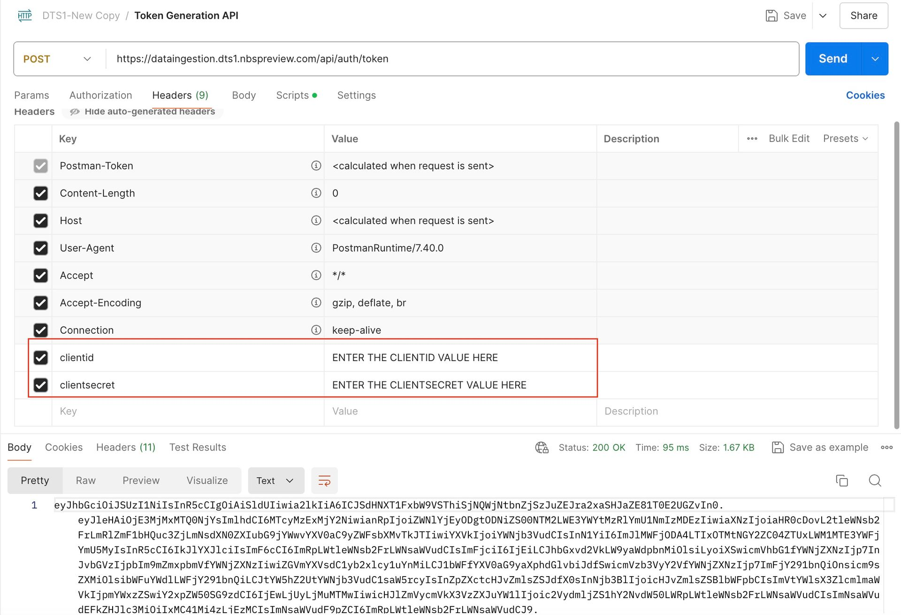
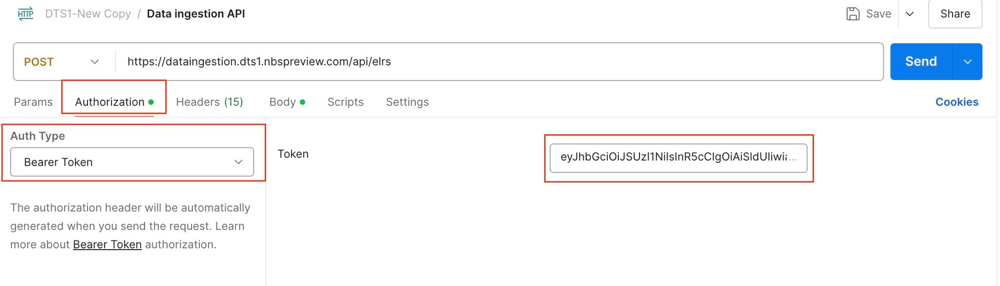
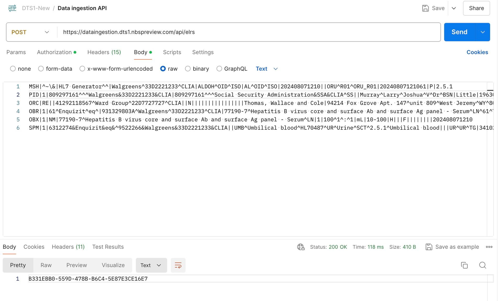
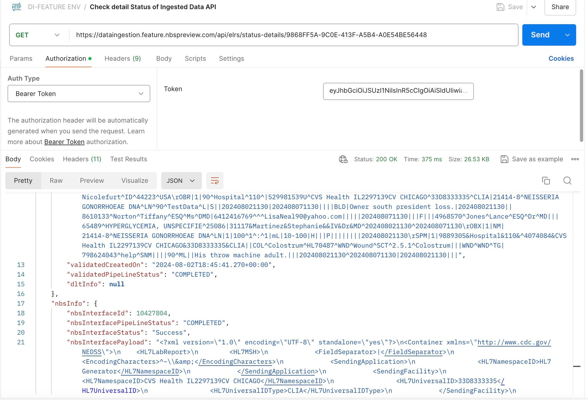

# Smoke test for data ingestion
{: .no_toc }

## On this page
{: .no_toc .text-delta }

1. TOC
{:toc}

## Overview

The data ingestion service is integrated with the Keycloak server to authenticate its public Data Ingestion API (DI API) endpoints.
As the **Client Credentials Grant type flow** is used for authentication in the data ingestion service, we require the **Client Id** and **Client Secret** values to create the JWT token and make API calls.

## Prerequisites

1. Keycloak server and the necessary configurations are set up.
2. Installation of Postman application to test the end-to-end flow.
   - If you already have Postman application in your system, skip this step.
   - Visit the official Postman website at [www.postman.com](https://www.postman.com) and navigate to the **Downloads** section:
     [Download Postman](https://www.postman.com/downloads/).
   - Download the version that is appropriate for your operating system. Once the download is complete, open and install it accordingly.

## Scope

1. Only ELR Data that are HL7 messages with ORU RO1 Data type are in scope.
2. Only HL7 messages with versions 2.3.1 and 2.5.1 are in scope.
3. The data ingestion service supports the transmit of HL7 messages with FHS header segments.

**Note:** Posting the same HL7 message more than once is allowed, but be aware that due to a duplicate check, the validation will fail within the data ingestion system.

## Run Data Ingestion Smoke Test

To load the Data Ingestion API collection in Postman, complete the following steps:

1. Open Postman and select **Import**.
1. In the import window, select `New-Data-Ingestion.postman_collection.json` from the release package.
1. Select **Open**.

The collection loads with all requests for the Data Ingestion service.

### Step 1: Token Generation API

Select the Token Generation API in the `New-Data-Ingestion` Postman collection.
Update the **clientid** and **clientsecret** values, then select **Send** to generate a new token.

> **Note:** Tokens expire after 1 hour. They must be regenerated using the same token endpoint after 1 hour or when they expire in order to make DI API calls.

### Step 2: Ingesting Data API

Select Ingesting Data API in New-Data-Ingestionpostman collection and then select Authorization tab and select **Bearer Token** as the type. Paste the token that was generated via Token Generation API in previous step into the token text box.

Select the **Headers** section and enter the values within the **clientid** and **clientsecret** headers.

A sample HL7 message has already been added to the request body section. Select Send button. UUID is displayed as a response. Please save this UUID which is useful to determine the status of the HL7 message.

> Wait 10-20 seconds before checking the status of Ingested Data API in Classic NBS. It takes a moment to generate an XML record into the `NBS_Interface` table after posting the HL7 message.
{: .note }

### Step 3: Check detailed status of Ingested Data API in Classic NBS

Select the **Checking Status of Ingested Data API** in the **New-Data-Ingestion** Postman collection and then select the **Authorization** tab. Paste the token that was generated via Token Generation API into the token text box.

Select the Headers section and enter the values within the **clientid** and **clientsecret** headers. Within the API URL, append the UUID generated as part of the response from the Ingesting Data API. Select **Send** button. By Default, all the status goes to `QUEUED` status.

The Classic Wildfly scheduler runs the batch job and processes this record. The scheduler is set to pick up and process the records every two minutes. Wait for two minutes and then select the **Send** button again. This time, the status should be **Success**.

The following API provides the ELR Ingestion status:

## Next steps

Continue to [Service integrations](./service-integrations.html).
