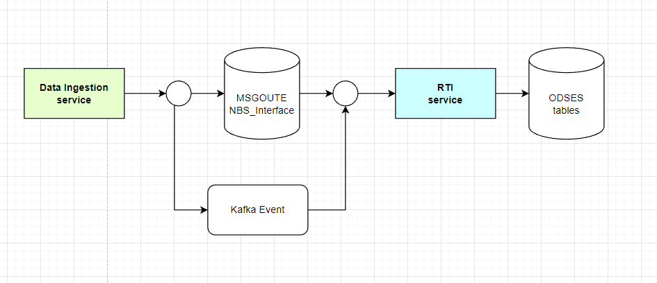
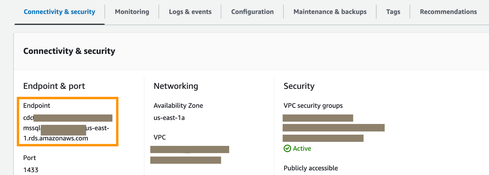

# Deploy the Data Processing service for NBS 7

This page walks through deploying the Real Time Ingestion (RTI) data processing service using the `data-processing-service` Helm chart from the [NEDSS-Helm][nedss-helm-data-processing-service-chart] repository for NBS version {{ site.version_latest }}. Complete [NBS Gateway](./nbs-gateway.html) before starting this page. After you finish, proceed to [NND Service (Data Sync)](./nnd-service.html).

## On this page
{: .no_toc .text-delta }

1. TOC
{:toc}

## Overview

RTI is a microservice that picks up ELR data after it has been ingested and queued in the NBS Interface table. It processes each record and either marks it as successful or delivers it to the NBS queue. Events are handled through Kafka. There is no direct user interaction with RTI. RTI is triggered through the Data Ingestion ELR endpoint and can work alongside the ELR importer batch job or replace it, providing near-real-time ELR processing without requiring a STLT-managed batch job.



## Deploy RTI using Helm

Use the [data-processing-service Helm chart][nedss-helm-data-processing-service-chart] to deploy the RTI service into your Kubernetes cluster. Before you begin, have your database credentials, Kafka endpoints, and Keycloak client secret available. See the [Helm values reference](./deploy-nbs7-microservices.html#helm-values-for-nbs-7-microservices) if you need help determining any values.

### RTI microservice

1. Use Git to clone your own local copy of the public [NEDSS-Helm repository][nedss-helm]. The following steps use the files in `charts/data-processing-service/` from that repository.
1. Confirm that a DNS entry for the data ingestion endpoint was created and points to the active Network Load Balancer (NLB) provisioned during [cluster infrastructure setup](../../deploy-nbs7/initial-kubernetes-deployment/initial-kubernetes-deployment.html). Then set `dataingestion.uri` in `values.yaml` to that domain name. Use the value from the [DNS records table](../../deploy-nbs7/initial-kubernetes-deployment/initial-kubernetes-deployment.html#create-dns-records).
1. Set the image repository and tag:

   ```yaml
   image:
     repository: "quay.io/us-cdcgov/cdc-nbs-modernization/data-processing-service"
     pullPolicy: IfNotPresent
     tag: <release-version-tag> # for example, v1.0.1
   ```

1. Set the auth user. RTI uses a valid NBS user to process data. Set `nbs.authuser` to a valid user from `ODSE.Auth_User`:

   ```yaml
   nbs:
     authuser: "superuser"
   ```

To find valid auth users, query the ODSE database. Replace `NBS_ODSE` if your database uses a different name:

   ```sql
   SELECT * FROM NBS_ODSE.dbo.Auth_user;
   ```

1. Set the JDBC connection values. The `dbserver` value is the database server endpoint only. Do not include the port number. For help determining these values, see the [Helm values reference](./deploy-nbs7-microservices.html#helm-values-for-nbs-7-microservices).

   

   ```yaml
   jdbc:
     dbserver: "EXAMPLE_DB_ENDPOINT"
     username: "EXAMPLE_ODSE_DB_USER"
     password: "EXAMPLE_ODSE_DB_USER_PASSWORD"
   nbs:
     authuser: "EXAMPLE_NBS_AUTHUSER"
   kafka:
     cluster: "EXAMPLE_KAFKA_ENDPOINT"
   dataingestion:
     uri: "data.EXAMPLE.DOMAIN"
   keycloak:
     srte:
       clientId: "EXAMPLE_SRTE_CLIENT_ID"
       clientSecret: "EXAMPLE_SRTE_CLIENT_SECRET"
   ```

1. Install the data processing service:

   ```bash
   helm install "data-processing-service" ./data-processing-service -f ./data-processing-service/values.yaml
   ```

1. Confirm the pod is running before continuing:

   ```bash
   kubectl get pods
   ```

1. See [RTI API testing and integration](../../deploy-nbs7/microservices-deployment/data-processing/api-testing.html) for API testing guidance.
1. Validate the service by running the two commands below and verifying the output is similar to what is shown. These commands require the [jq JSON processor](https://jqlang.org/download/) to be installed.

   Run the info endpoint to confirm the service version and build details:

   ```bash
   curl --silent https://<data.EXAMPLE_DOMAIN>/rti/actuator/info | jq
   ```

   Expected output:

   ```text
   {
   "build": {
      "artifact": "data-processing-service",
      "name": "data-processing-service",
      "time": "2026-03-24T15:47:15.920Z",
      "version": "7.11.1-SNAPSHOT",
      "group": "gov.cdc.dataprocessing"
   },
   "java": {
      "version": "21.0.10",
      "vendor": {
         "name": "Amazon.com Inc.",
         "version": "Corretto-21.0.10.7.1"
      },
      "runtime": {
         "name": "OpenJDK Runtime Environment",
         "version": "21.0.10+7-LTS"
      },
      "jvm": {
         "name": "OpenJDK 64-Bit Server VM",
         "vendor": "Amazon.com Inc.",
         "version": "21.0.10+7-LTS"
      }
   }
   }
   ```

   Run the health endpoint to confirm the service is running:

   ```bash
      curl --silent https://<data.EXAMPLE_DOMAIN>/rti/actuator/health | jq
   ```

   Expected output:

   ```text
   {
   "status": "UP",
   "groups": [
      "liveness",
      "readiness"
   ],
   "components": {
      "db": {
         "status": "UP",
         "components": {
         "nbsDataSource": {
            "status": "UP",
            "details": {
               "database": "Microsoft SQL Server",
               "validationQuery": "isValid()"
            }
         },
         "odseDataSource": {
            "status": "UP",
            "details": {
               "database": "Microsoft SQL Server",
               "validationQuery": "isValid()"
            }
         },
         "srteDataSource": {
            "status": "UP",
            "details": {
               "database": "Microsoft SQL Server",
               "validationQuery": "isValid()"
            }
         }
         }
      },
      "diskSpace": {
         "status": "UP",
         "details": {
         "total": 42869960704,
         "free": 21168852992,
         "threshold": 10485760,
         "path": "/.",
         "exists": true
         }
      },
      "livenessState": {
         "status": "UP"
      },
      "ping": {
         "status": "UP"
      },
      "readinessState": {
         "status": "UP"
      },
      "ssl": {
         "status": "UP",
         "details": {
         "validChains": [],
         "invalidChains": []
         }
      }
   }
   }
   ```

[nedss-helm]: <https://github.com/CDCgov/NEDSS-Helm/tree/{{ site.version_latest_tag }}>
[nedss-helm-data-processing-service-chart]: <https://github.com/CDCgov/NEDSS-Helm/tree/{{ site.version_latest_tag }}/charts/data-processing-service>
