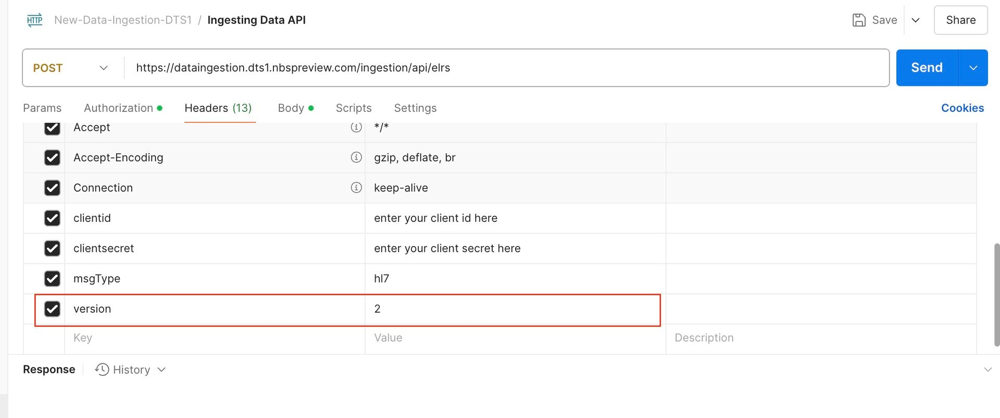
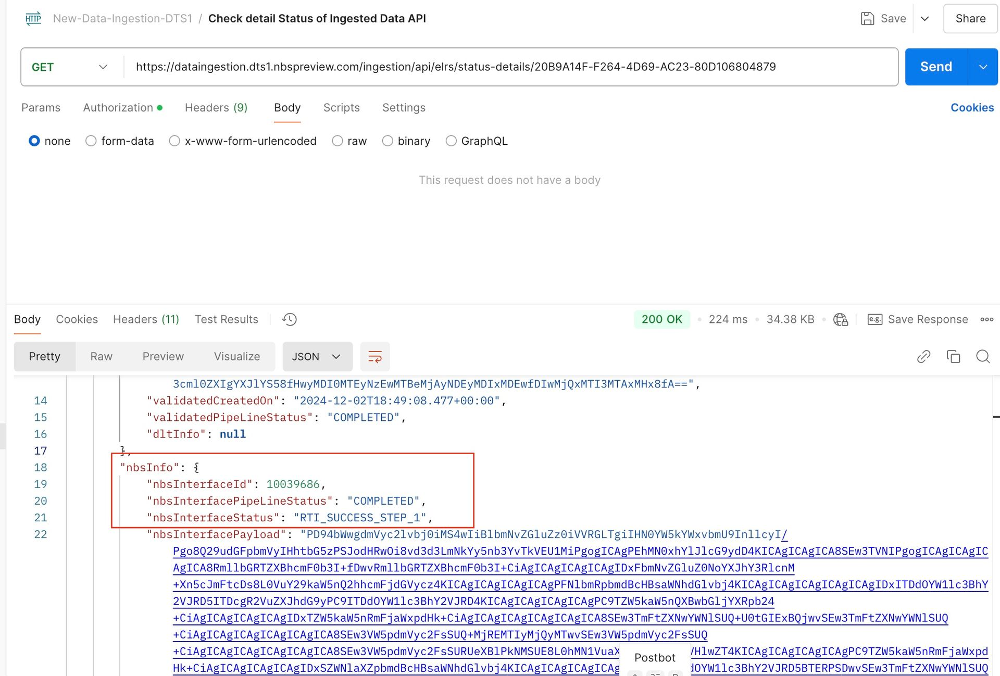
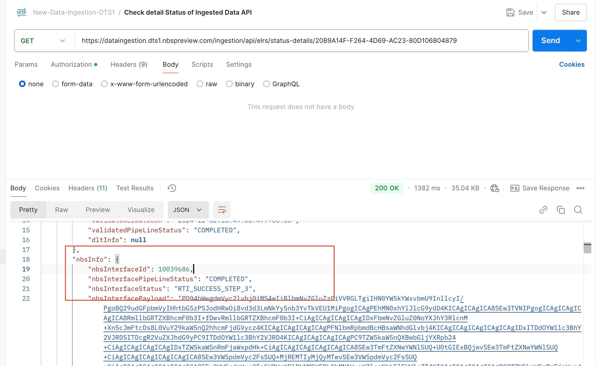

# Test RTI API integration for Data Processing

Use this page to validate Real Time Ingestion (RTI) by sending ELR data through the Data Ingestion endpoint and verifying RTI processing outcomes.

## On this page
{: .no_toc .text-delta }

1. TOC
{:toc}

## Prerequisites

This procedure uses Postman to send API requests. Download and install Postman from the [Postman installation page](https://learning.postman.com/docs/getting-started/installation/installation-and-updates).

## Run the integration test

This section covers submitting an ELR payload and triggering RTI processing.

1. Follow the [Data Ingestion API testing guide](../../data-ingestion/api-testing.html) to submit ELR payloads.
1. In the API testing guide, locate the ELR ingestion endpoint (`/api/elrs`) and add the `version` header to that endpoint in the ELR ingestion API call:
   - `version: 1` uses the legacy batch importer flow.
   - `version: 2` bypasses the legacy batch importer and triggers RTI.

   For RTI testing, this header is the only required API change. The following screenshot shows the `version` header set to `2` in Postman:

   

## Validate ingestion and RTI processing status

Use the DI status endpoint (`/api/elrs/status-details`) to verify processing status after submission.

- Legacy flow status values in `NBS_Interface`: `QUEUED`, `FAILED`, `SUCCESS`.
- RTI flow status values in `NBS_Interface`: `RTI_QUEUED`, `RTI_FAILURE`, `RTI_SUCCESS_STEP_N`.

RTI processing can complete in three status steps:

- `RTI_SUCCESS_STEP_1`: Data passed through core processing and should be available in the ODSE database.
- `RTI_SUCCESS_STEP_2`: Applies when a WDS algorithm is configured; the service runs WDS comparison.
- `RTI_SUCCESS_STEP_3`: Triggered after WDS completes; the service assigns the appropriate action for the ingested payload.

The following screenshot shows an example response from the status endpoint with an `RTI_SUCCESS_STEP_1` result:

The following screenshot shows an example response with an `RTI_SUCCESS_STEP_3` result:

