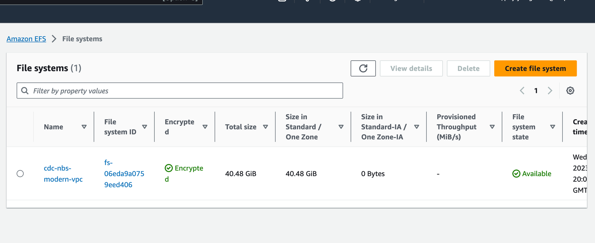

# Deploy Elasticsearch for NBS 7

This page walks through deploying Elasticsearch using the `elasticsearch-efs` Helm chart.

## On this page
{: .no_toc .text-delta }

1. TOC
{:toc}

## Deploy Elasticsearch using Helm

1. Locate the Helm chart at `charts/elasticsearch-efs`.
1. Set `efsFileSystemId` in `values.yaml` to the EFS file system ID from the AWS console.

   

1. Set the image repository and tag:

   ```yaml
   image:
      repository: "quay.io/us-cdcgov/cdc-nbs-modernization/elasticsearch"
      tag: <release-version-tag> // for example, v1.0.2
   ```

1. Install Elasticsearch:

   ```bash
   helm install elasticsearch -f ./elasticsearch-efs/values.yaml elasticsearch-efs
   ```

1. Confirm the pod is running before proceeding to the next deployment:

   ```bash
   kubectl get pods
   ```

   If the pod is still creating or in any other state, wait and troubleshoot before continuing.
