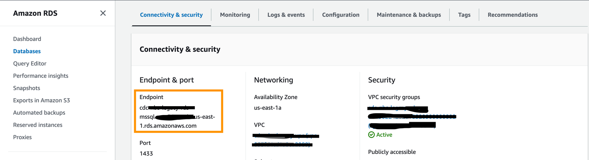
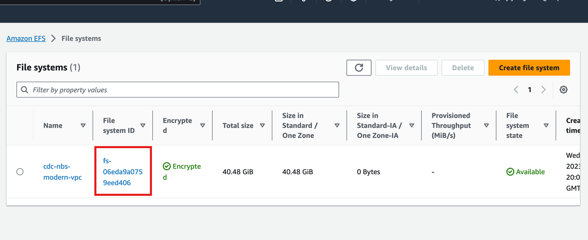

# Deploy Data Sync service API (cloud)

Use these steps to install the NBS 7 Data Sync service API in your cloud environment.

## On this page
{: .no_toc .text-delta }

1. TOC
{:toc}

> This page applies to NBS {{ site.version_latest }}. Helm chart links are pinned to `{{ site.version_latest_tag }}`.
{: .note }

## Prerequisites

1. Locate the NND Service Helm chart in the [NEDSS-Helm repository][nedss-helm-nnd-service-chart]. Provide values for ECR repository, ECR image tag, database server endpoints, and ingress host in the `values.yaml` file.

2. Confirm that the following DNS entry was created and points to the Network Load Balancer (NLB) in front of your Kubernetes cluster (make sure this is the active NLB provisioned in the base install steps). Do this in your authoritative DNS service, such as Route 53.
   Replace `example.com` with the appropriate domain name in the `values.yaml` file.
   NND service application, for example: `data.example.com`

## Configure values and install

1. Update the image repository and tag with the following:

   ```yaml
   image:
     repository: "quay.io/us-cdcgov/cdc-nbs-modernization/nnd-service"
     pullPolicy: IfNotPresent
     tag: <release-version-tag> e.g v1.0.1
   ```

2. Update the values file with JDBC connection values in the following format. The `dbserver` value is only a database server endpoint. Do not include the port number.

   

   ```yaml
   jdbc:
     dbserver: "EXAMPLE_DB_ENDPOINT"
     username: "EXAMPLE_ODSE_DB_USER"
     password: "EXAMPLE_ODSE_DB_USER_PASSWORD"
   ```

3. Update `values.yaml` to populate `efsFileSystemId`, which is the EFS file system ID from the AWS console.

   

   ```yaml
   efsFileSystemId: "EXAMPLE_EFS_ID"
   ```

4. Provide the Keycloak auth URI in `values.yaml` as shown below. In the default configuration, this value should not change unless the name or namespace of the Keycloak pod is modified.

   ```yaml
   authUri: "http://keycloak.default.svc.cluster.local/auth/realms/NBS"
   ```

5. Run the following command to install `nnd-service`.

   ```bash
   helm install nnd-service -f ./nnd-service/values.yaml nnd-service
   ```

6. Check whether the `nnd-service` pod is running by using `kubectl get pods`.

## Validate the deployment

1. Validate the service by accessing:

   ```text
   https://<data.EXAMPLE_DOMAIN>/extraction/actuator/info
   https://<data.EXAMPLE_DOMAIN>/extraction/actuator/health
   ```

2. Swagger is disabled by default (usually in production). To enable Swagger for testing, specify or overwrite `springBootProfile` with `'dev'` under `charts/nnd-service/values.yaml`.

   ```text
   https://<data.EXAMPLE_DOMAIN>/extraction/swagger-ui/index.html#/
   ```

[nedss-helm-nnd-service-chart]: <https://github.com/CDCgov/NEDSS-Helm/tree/{{ site.version_latest_tag }}/charts/nnd-service>
