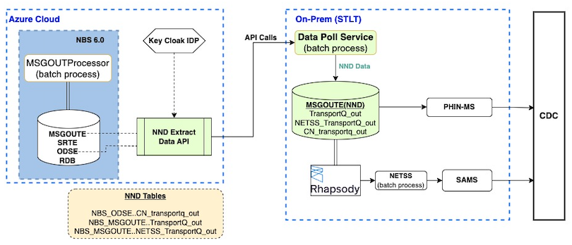
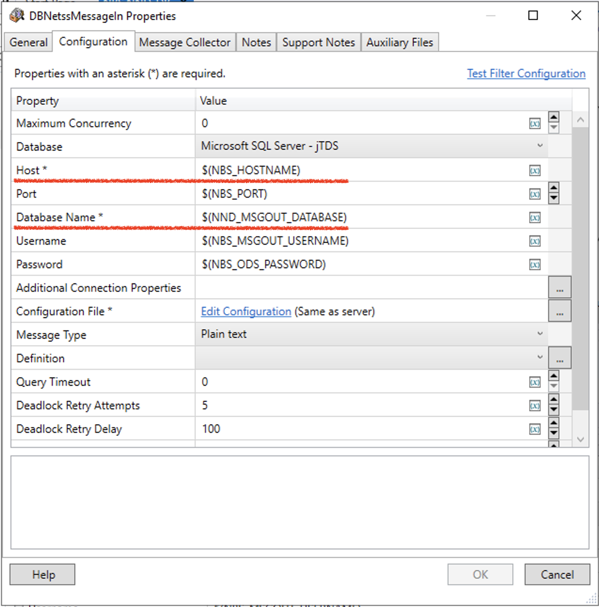
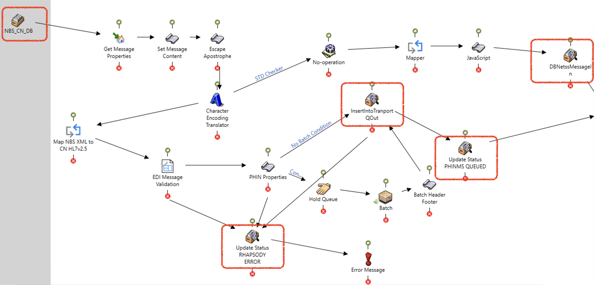

# Deploy NND Sync

Use these instructions to deploy the on-premises Data Sync service that extracts data from the Modernized NBS cloud implementation and supports ongoing Notifiable Disease message transmission to CDC. Complete [Validate API endpoints](./validating-api-endpoints.html) before starting this page.

> This page is part of the optional [NND Service (Data Sync)](../nnd-service.html) section. CDC is evaluating long-term support for this service. If your STLT has a use case, contact [nbs@cdc.gov](mailto:nbs@cdc.gov).
{: .important }

## On this page
{: .no_toc .text-delta }

1. TOC
{:toc}

## Prerequisites

To sync data for NNDSS through the NBS 7 Data Sync service, you need the following:

- Complete [Validate API endpoints](./validating-api-endpoints.html).
- **Keycloak client ID and client secret** - Retrieve these from your Keycloak instance. In the **NBS** realm, go to **Clients** > `nnd-keycloak-client` > **Credentials** > **Client Secret**.
- **Data service URL** - Retrieve this from your NBS environment.
- **Release materials/package** - CDC provides this as a .zip file with each release.
- Install the **Rhapsody engine and IDE**.
- Install a **Microsoft SQL Server database** on a different machine, or repurpose an existing SQL Server database (Rhapsody should have access to it).
- **Java 21 or higher**

---

## Components for NND Sync

NNDSS Data Sync service includes:

- `data-sync-service.jar`
- `netss-message-processor.jar`
- `.cmd` files (only for Windows environments)
- `.sql` files (to create NND Database and required objects)

---

## Set up the Data Sync service for NNDSS

Download the Data Sync service files (`.jar`, `.cmd`, and `.sql`) from the [NEDSS-NNDSS {{ site.version_latest_tag }} release page][nedss-nndss-release-page]. Under **Assets**, download the `{{ site.version_latest_tag }}.NEDSS.NBS.Modernized.Documentation.zip` file and locate the files in the `data-sync/NND_SERVICE/` directory.
Save the files to a secure directory with executable permissions to run the services.

---

### Step 1: Configure command or execute script (`.cmd` file)

- The release materials include a configurable `.cmd` script file that runs the Data Sync service.
- Replace the values for arguments in the file with your own.
- **Important:** Do not allow any space between the argument name and value.
  - Example: `arg_name=arg_value`

Reference for arguments: [README][nedss-nndss-readme]

---

### Step 2: Build or reuse the database and database objects

- Create a separate database and tables for the new service.
- Use the provided `.sql` scripts to create the required database and tables.

**Tables required in the new database:**

- `TransportQ_out`
- `CN_transportQ_out`
- `NETSS_transportQ_out`

Ensure the database is accessible from Rhapsody.

---

### Step 3: Update connection details on Rhapsody routes

- Update only variables in the route's **database components**.
- Point them to the new database and tables from the previous step.

**Steps:**

1. Log in to the Rhapsody console
2. Open **Variables Manager** and confirm the route has the correct hostname and new database name
3. Open all database components in the route and verify they refer to the right database variable

**List of database components to update in the Rhapsody route** (highlighted in red boxes in provided documentation).

---

### Step 4: Configure and verify PHINMS and SAMS

#### PHINMS

- Verify and update database connections for the existing PHINMS setup.

#### SAMS

- Verify that the file drop-off location in NETSS service parameters matches the location that SAMS reads.

---

## Repo reference

- GitHub: [NEDSS-NNDSS repository](https://github.com/CDCgov/NEDSS-NNDSS)

[nedss-nndss-release-page]: <https://github.com/CDCgov/NEDSS-NNDSS/releases/tag/{{ site.version_latest_tag }}>
[nedss-nndss-readme]: <https://github.com/CDCgov/NEDSS-NNDSS/tree/{{ site.version_latest_tag }}/nnd-data-poll-service#readme>
