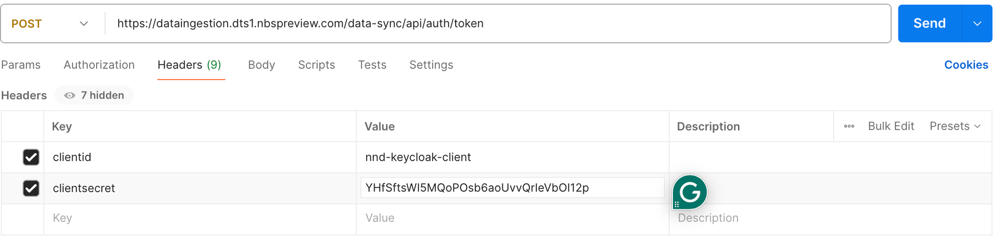
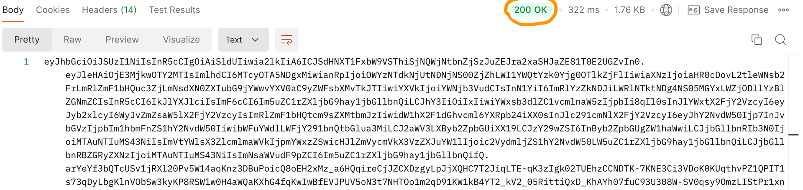

# Validate API endpoints

Use this check to confirm that your environment can reach the Data Sync API before you sync data.

In production, the Data Sync service calls these endpoints. System administrators still need to validate connectivity and credentials during setup.

## On this page
{: .no_toc .text-delta }

1. TOC
{:toc}

## Validate token generation in Postman

The token endpoint returns a JWT token that clients use to access secured Data Sync endpoints.

**Endpoint:** `https://data.<your-site>.<your-domain>.com/data-sync/api/auth/token`

**Prerequisite:** The STLT administrator must create values for `clientid` and `clientsecret`.

**HTTP method:** `POST`

**Authorization type:** `NONE`

1. Open Postman and send a `POST` request to the token endpoint.
1. Add two request headers:
   - `clientid`
   - `clientsecret`

1. Select **Send**.
1. Confirm that the response status is `200 OK` and that a JWT token returns.

## Validate service endpoints in Swagger

After token generation succeeds, validate the service endpoints in Swagger:

`https://<host>/data-sync/swagger-ui/index.html`

> Use Postman for endpoint validation. You can also use Swagger to inspect and test endpoints.
{: .note }
