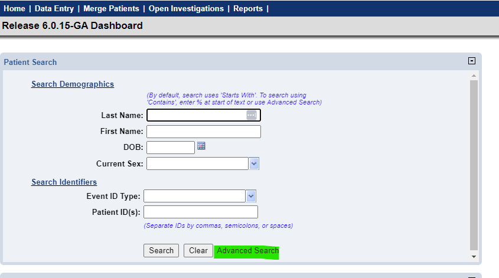
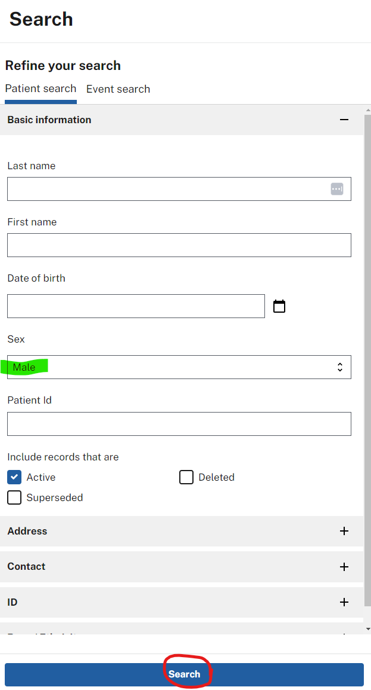
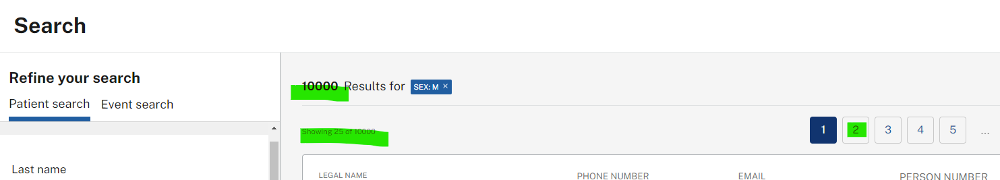

# Manual validation for Elasticsearch, Modernization API, and NiFi

Use these steps to validate end-to-end behavior in the NBS UI after deploying Elasticsearch, Modernization API, and NiFi.

1. Log in to NBS using your configured URL, for example: `https://app.<your-site>.<your-domain>.com/nbs/login`.
1. Select **Advanced Search**:

   
1. Run a search. For example, select **Male** from the **Sex** drop-down and select **Search**:

   
1. Confirm that results appear in the results pane:

   
