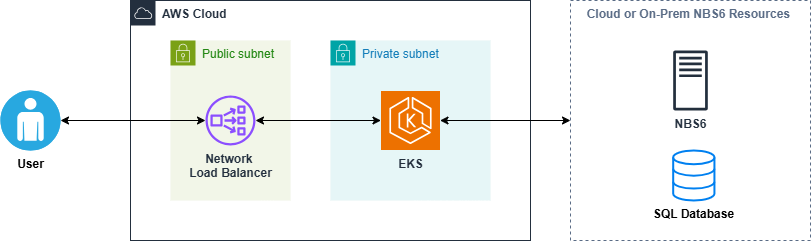

# Quick start (AWS)

This page provides a streamlined path to deploy NBS 7 infrastructure and core microservices in AWS. It is intended for experienced administrators familiar with AWS, Kubernetes, Helm, and Terraform.

## On this page
{: .no_toc .text-delta }

1. TOC
{:toc}

## Scope and limitations

This guide is not intended for production deployment. For full production steps and guidance, see [Deploy NBS 7](../deploy-nbs7.html).
{: .important }

Before starting this quick start, confirm your NBS 6 version is compatible with your target NBS 7 version in the [NBS 6 and NBS 7 compatibility matrix](../supported-versions.html).

This quick start installs and configures the following resources.

### Terraform-managed resources

- Modern VPC, subnets, and route tables
- Amazon EKS cluster and nodes
- Network Load Balancer (NLB)
- Amazon MSK
- Amazon Managed Service for Prometheus
- Amazon Managed Grafana
- Amazon EFS
- AWS KMS
- Amazon S3 bucket

### Manual configuration

- **Route53 updates**: create DNS entries in Route53 to point app and data URLs to the Network Load Balancer.

### NBS 7 core services

- **Elasticsearch**: Search indexing and query support.
- **Modernization API**: Modern NBS capabilities, including patient and event search.
- **NiFi**: Elasticsearch index population from the NBS database.
- **NBS Gateway**: Routing between modern and legacy NBS.
- **Data ingestion**: HL7 ingestion from labs and other sources.
- **Keycloak**: Primary identity provider (IdP), token management, and SSO integration.

## Prerequisites

### Install these tools

- [AWS CLI](https://aws.amazon.com/cli/) (v2.15+)
- [Terraform](https://developer.hashicorp.com/terraform/tutorials/aws-get-started/install-cli) (v1.5.5)
- [Helm](https://helm.sh/docs/intro/install/) (v3.12+)
- [kubectl](https://docs.aws.amazon.com/eks/latest/userguide/install-kubectl.html) (v1.27+)
- [eksctl](https://eksctl.io/installation/) (optional but recommended)

### Environment requirements

- AWS Account with NBS 6.0.16 access (or newer)
- DNS routing infrastructure: domain information for modernized NBS application URLs (for example, `app.site_name.domain.com`)
- IAM roles for Terraform and Kubernetes
- Access to NBS 6 (SQL Server) databases to run scripts
- S3 bucket for Terraform state

## Set up AWS infrastructure (Terraform)



### Prepare the directory

```bash
mkdir -p ~/nbs-setup/terraform/aws/nbs7-mySTLT-test
cd ~/nbs-setup/terraform/aws/nbs7-mySTLT-test
```

### Download Terraform configuration

Clone the infrastructure repo:

```bash
git clone https://github.com/CDCgov/NEDSS-Infrastructure.git
```

Copy standard template:

```bash
cp -pr terraform/aws/samples/NBS7_standard terraform/aws/nbs7-mySTLT-test
```

### Customize variables

- Update the `terraform.tfvars` and `terraform.tf` with your environment-specific values by following the [NEDSS infrastructure sample configuration instructions][nedss-infra-aws-samples-readme].

> Review inbound rules on the security groups attached to your database instance. Ensure the CIDR you intend to use with your NBS 7 VPC (`modern-cidr`) is allowed to access the database.
{: .note }

### Initialize and apply Terraform

```bash
terraform init
terraform plan
terraform apply
```

### Validate infrastructure

- Confirm VPC, Amazon EKS cluster, subnets, and node groups are created.
- Verify Amazon EKS cluster authentication and running pods and nodes:

```bash
aws eks --region us-east-1 update-kubeconfig --name <clustername> e.g. cdc-nbs-sandbox
kubectl get pods --namespace=cert-manager
kubectl get nodes
```

## Deploy core Kubernetes services (Helm)

### Install NGINX Ingress

```bash
helm repo add ingress-nginx https://kubernetes.github.io/ingress-nginx
helm install ingress-nginx ingress-nginx/ingress-nginx
kubectl --namespace ingress-nginx get services -o wide -w ingress-nginx-controller
kubectl get pods -n=ingress-nginx
```

### Create DNS entries in Route53

- Point the modernized NBS application URL to the new Network Load Balancer in front of your Kubernetes cluster.

```bash
app.<site_name>.<domain>.com
```

- Point the data services URL to the new Network Load Balancer in front of your Kubernetes cluster.

```bash
data.<site_name>.<domain>.com
```

### Install Cert Manager (optional)

```bash
helm repo add jetstack https://charts.jetstack.io
helm install cert-manager jetstack/cert-manager --namespace cert-manager --create-namespace --set installCRDs=true
```

### Install and verify Linkerd (optional)

```bash
kubectl annotate namespace default "linkerd.io/inject=enabled"
kubectl get namespace default -o=jsonpath='{.metadata.annotations}'
```

### Install Cluster Autoscaler (optional)

```bash
helm repo add autoscaler https://kubernetes.github.io/autoscaler
helm install cluster-autoscaler autoscaler/cluster-autoscaler -n kube-system
```

### Verify services are running

```bash
kubectl get pods -A
```

## Install Keycloak

Create the Keycloak database. Make sure to update the database password.

```sql
use master
    IF NOT EXISTS(SELECT * FROM sys.databases WHERE name = 'keycloak')
    BEGIN
        CREATE DATABASE keycloak
    END
GO
    USE keycloak
GO

BEGIN
    CREATE LOGIN NBS_keycloak WITH PASSWORD = 'EXAMPLE_KCDB_PASS8675309';
    CREATE USER NBS_keycloak FOR LOGIN NBS_keycloak;
    EXEC sp_addrolemember N'db_owner', N'NBS_keycloak'
END
```

### Install Keycloak container

Edit the following parameters in `<helm extract directory>/charts/keycloak/values.yml`:

- `kcDbPassword`
- `kcDbUrl`
- `keycloakAdminPassword`
- `efsFileSystemId`

```bash
helm install keycloak --namespace default --create-namespace -f keycloak/values.yaml
```

### Port forward to access Keycloak admin interface

```bash
kubectl --namespace default port-forward "$POD_NAME" 8080;
http://127.0.0.1:8080/auth
```

### Configure realms, users, and clients

- Log in as the Keycloak admin user.
- Upload `<helm extract directory>/charts/keycloak/extra/01-NBS-realm-with-DI-client.json`.
- Upload `<helm extract directory>/charts/keycloak/extra/05-nbs-users-nnd-client.json`.
- Upload `<helm extract directory>/charts/keycloak/extra/02-nbs-users-realm.json`.
- Run partial import from the `nbs-users` realm for `<helm extract directory>/charts/keycloak/extra/03-nbs-users-base-users.json`.
- Run partial import from the `nbs-users` realm for `<helm extract directory>/charts/keycloak/extra/04-nbs-users-development-clients.json`.

## Deploy NBS 7 microservices (Helm)

Deploy the Helm charts in the following order.

1. `elasticsearch-efs`
2. `modernization-api`
3. `nifi-efs`
4. `nbs-gateway`
5. `dataingestion-service`

> Run the following commands from the `<helm extract directory>/charts` directory.
{: .note }

### Deploy Elasticsearch

Update the required parameters in `values.yaml` by following the [Elasticsearch EFS chart values table][nedss-helm-elasticsearch-efs-readme]

```bash
helm install elasticsearch -f ./elasticsearch-efs/values.yaml elasticsearch-efs
```

### Deploy Modernization API

Update the required parameters in `values.yaml` by following the [Modernization API chart values table][nedss-helm-modernization-api-readme]

```bash
helm install modernization-api -f ./modernization-api/values.yaml modernization-api
```

### Deploy NiFi

Update the required parameters in `values.yaml` by following the [NiFi EFS chart values table][nedss-helm-nifi-efs-readme]

```bash
helm install nifi -f ./nifi-efs/values.yaml nifi-efs
```

### Deploy NBS Gateway

Update the required parameters in `values.yaml` by following the [NBS Gateway chart values table][nedss-helm-nbs-gateway-readme]

```bash
helm install nbs-gateway -f ./nbs-gateway/values.yaml nbs-gateway
```

### Deploy Data ingestion service

Create the Data Ingest database and set user permissions before deploying data ingestion:

```sql
IF NOT EXISTS(SELECT * FROM sys.databases WHERE name = 'NBS_DataIngest')
BEGIN
    CREATE DATABASE NBS_DataIngest
END
GO
USE NBS_DataIngest
GO
```

```sql
use [NBS_ODSE];
GO
USE [NBS_DataIngest]
GO
CREATE USER [nbs_ods] FOR LOGIN [nbs_ods]
GO
USE [NBS_DataIngest]
GO
ALTER USER [nbs_ods] WITH DEFAULT_SCHEMA=[dbo]
GO
USE [NBS_DataIngest]
GO
ALTER ROLE [db_owner] ADD MEMBER [nbs_ods]
GO
```

Update the required parameters in `values.yaml` by following the [Data Ingestion Service chart values table][nedss-helm-dataingestion-service-readme]

```bash
helm install dataingestion-service -f ./dataingestion-service/values.yaml dataingestion-service
```

### Verify services

- Confirm all pods are running before moving on.

```bash
kubectl get pods -A
```

## Validate installation

### Manual tests

- Log in to the NBS UI (for example, [https://app.example.com/nbs/login](https://app.example.com/nbs/login)).
- Confirm basic patient search functionality.

### Automated tests

- Use `nbs-test-api.sh` and `nbs-test-webui.sh` for basic API and UI smoke tests.

## Cleanup

Follow these steps to clean up the environment.

> These cleanup steps remove ingress resources and can immediately interrupt access to NBS 7 endpoints in this environment.
{: .warning }

1. Remove DNS entries:
    - `app.<site_name>.<domain>.com`
    - `data.<site_name>.<domain>.com`

> Running `terraform destroy` permanently deletes infrastructure managed by this Terraform workspace.
{: .warning }

```bash
# Remove nlb and ingress routing
helm list --namespace ingress-nginx
helm uninstall --namespace ingress-nginx ingress-nginx

# Empty fluentbit s3 bucket manually

terraform destroy
```

## Support

- For support, contact <mailto:NBSSupport@cdc.gov>.
- For ongoing updates, check the GitHub repo for new releases.

[nedss-infra-aws-samples-readme]: <https://github.com/CDCgov/NEDSS-Infrastructure/blob/{{ site.version_latest_tag }}/terraform/aws/samples/README.md>
[nedss-helm-elasticsearch-efs-readme]: <https://github.com/CDCgov/NEDSS-Helm/blob/{{ site.version_latest_tag }}/charts/elasticsearch-efs/README.md>
[nedss-helm-modernization-api-readme]: <https://github.com/CDCgov/NEDSS-Helm/blob/{{ site.version_latest_tag }}/charts/modernization-api/README.md>
[nedss-helm-nifi-efs-readme]: <https://github.com/CDCgov/NEDSS-Helm/blob/{{ site.version_latest_tag }}/charts/nifi-efs/README.md>
[nedss-helm-nbs-gateway-readme]: <https://github.com/CDCgov/NEDSS-Helm/blob/{{ site.version_latest_tag }}/charts/nbs-gateway/README.md>
[nedss-helm-dataingestion-service-readme]: <https://github.com/CDCgov/NEDSS-Helm/blob/{{ site.version_latest_tag }}/charts/dataingestion-service/README.md>
