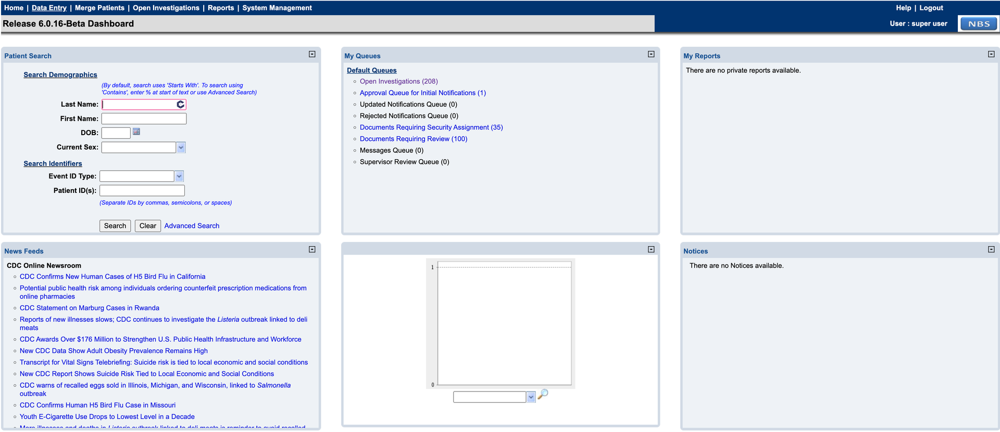
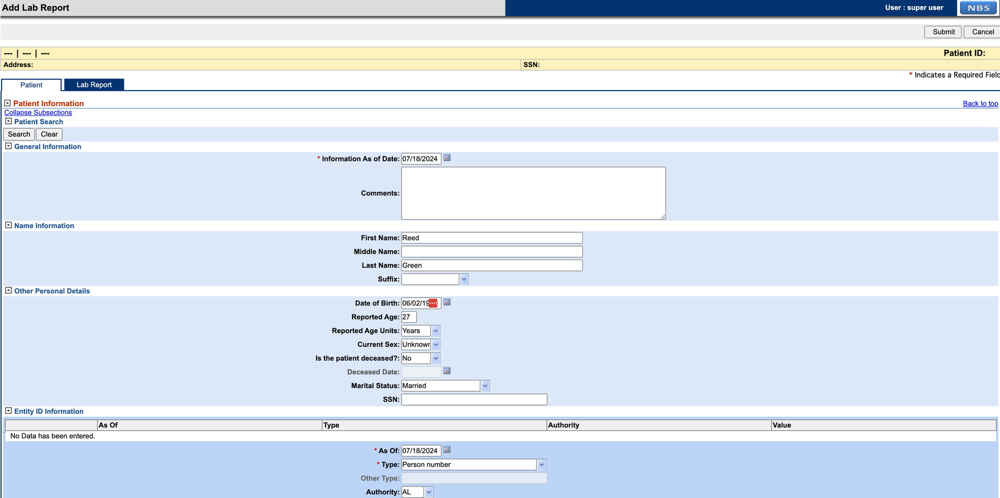
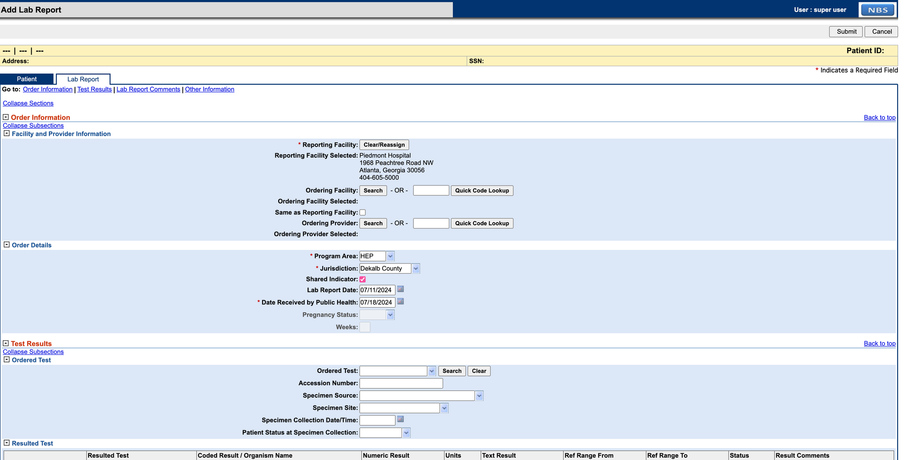
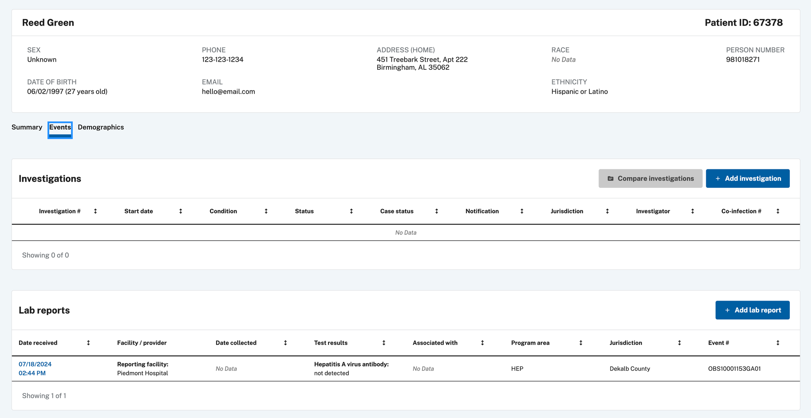
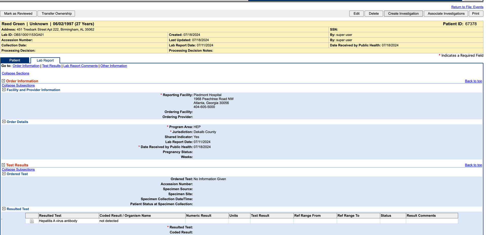
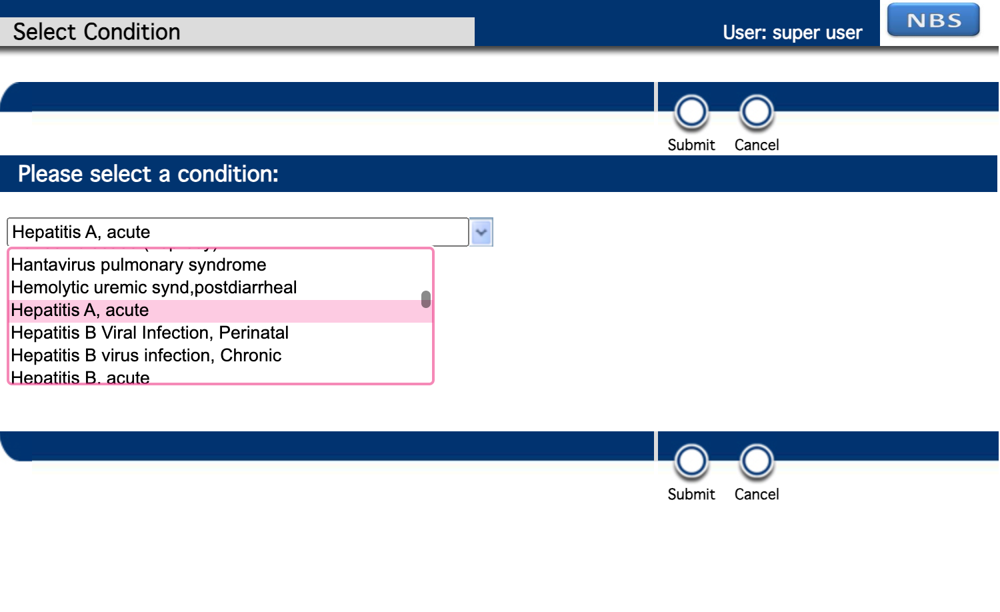
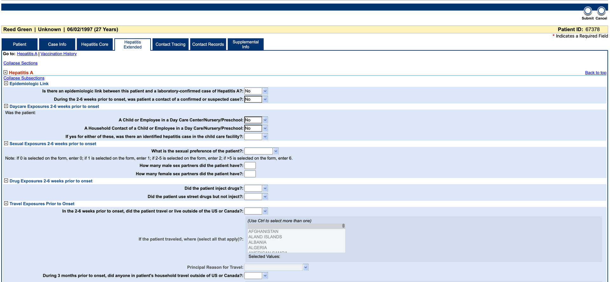
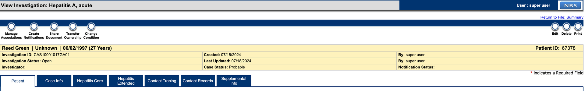

# Validate the real-time reporting (RTR) pipeline

Use this page to validate that RTR streaming updates move from ingestion through processing into reporting datamart tables.

## On this page
{: .no_toc .text-delta }

1. TOC
{:toc}

## Validate using the NBS UI

This example uses a synthetic Hepatitis investigation to verify that data flows from the NBS UI through RTR into the reporting datamart tables. The data used is synthetic and randomly generated.

1. Sign in to NBS and click **Data Entry** in the top banner.

   

1. Under **Data Entry**, select **Lab Report** to start a report.

   

1. Add patient information to the lab report. Entity ID is required to complete the **Patient** tab. If SSN is selected as the identifier type, set the authority to `Social Security Administration`.

   

1. Select the **Lab Report** tab and fill in the required details. For this example, set **Program Area** to HEP. Complete the **Resulted Test** section before submitting. Click **Submit** when done. Correct any errors shown in red and resubmit.

   

1. Navigate to the patient record using **Patient Search** or find the lab report in the **Documents Requiring Review** queue. From the patient record, open the **Events** tab to view the lab report.

   

1. Click **Create Investigation** in the upper right corner.

   

1. Select a Hepatitis condition.

   

1. Complete the Investigation form and click **Submit**.

   

1. After 1–2 minutes, verify the data is available in the `PUBLICHEALTHCASEFACT_Modern` and Hepatitis datamarts. Use the Investigation Local ID from the form to replace the example value in the query below.

   

   ```sql
   -- Replace 'CAS10001017GA01' with the Investigation Local ID from the form
   DECLARE @local_id VARCHAR(20) = 'CAS10001017GA01'

   SELECT LASTUPDATE, PHCF.*
   FROM NBS_ODSE.DBO.PUBLICHEALTHCASEFACT_Modern PHCF
   WHERE LOCAL_ID IN (@local_id);

   SELECT REFRESH_DATETIME, hd.*
   FROM RDB_MODERN.DBO.HEPATITIS_DATAMART hd
   WHERE INV_LOCAL_ID IN (@local_id);

   SELECT cl.*
   FROM RDB_MODERN.DBO.CASE_LAB_DATAMART cl
   WHERE INVESTIGATION_LOCAL_ID IN (@local_id);

   SELECT isd.*
   FROM RDB_MODERN.DBO.INV_SUMM_DATAMART isd
   WHERE INVESTIGATION_LOCAL_ID IN (@local_id);
   ```

1. If data is missing from the datamart tables, run the following query to check for SQL script errors. If errors persist, contact support at <mailto:nbs@cdc.gov>.

   ```sql
   SELECT *
   FROM RDB_MODERN.DBO.JOB_FLOW_LOG
   WHERE Status_Type = 'ERROR'
   ORDER BY batch_id desc;
   ```

## Validate using ELR ingestion

Instead of creating entries through the NBS UI, you can test the pipeline using ELR (Electronic Lab Report) ingestion through the Data Ingestion service. See the [Data Ingestion smoke test](../data-ingestion/smoke-test.html) for detailed steps.

If Workflow Decision Support (WDS) is configured and a matching algorithm is detected during a HEP ELR ingestion, an investigation is automatically created and added to the investigation queue. If WDS is not configured, the ELR is still ingested and appears in the **Documents Requiring Review** queue. Open the HEP lab report and continue from step 5 of the UI validation process above.

The data used for this example is synthetic and randomly generated. Any HEP-related ELR (Hepatitis A, B, C, etc.) can be used. The following sample Hepatitis A ELR can be used for testing:

```text
MSH|^~\&|HL7 Generator^^|Family Health Center^42D7444477^CLIA|ALDOH^OID^ISO|AL^OID^ISO|202408261214||ORU^R01^ORU_R01|20240826121475|P|2.5.1
PID|1|239082358^^^Family Health Center&42D7444477&CLIA|239082358^^^Social Security Administration&SSA&CLIA^SS||Sanchez^Andrew^Frank^ESQ^Mrs^JD|Lin|196903240000|F|kavita|2076-8^Native Hawaiian or Other Pacific Islander^CDCREC|35381 Randy Passage Suite 203^unit 7779^Natashahaven^LA^30342^USA||^^^JaredLee75@yahoo.com^^732^9566115^4740|^^^AndrewSanchez75@hotmail.com^^732^1499917^4740|ENG|T^^^^^|||042-80-2420|||2186-5^Not Hispanic or Latino|Wagnerburgh|Y|3|||USA|202408051214|Y
PV1||R
ORC|RE||94884048343^Russell, Chandler and Potts^34D4434343^CLIA||N||||||||||||||||Lowery-Gonzalez|175 Flores Highway Suite 629^unit 2037^Devinburgh^DE^47827^USA|^^^^^^979^7323277^2821|96626 Tamara Ports Apt. 716^unit 31129^Port Heatherstad^NC^24461^USA
OBR|1|75^Test Org 2 AC^1234^|804164994m^Family Health Center^42D7444477^CLIA|40724-7^Hepatitis A virus IgG Ab [Presence] in Serum by Immunoassay^LN^75^TestData^L|S||202408261214|202408311214||||BLD|Back anything crime everything such research.|202408261214||5860083^Mullen^Sarah^II^Mr^BS|2964833605^^^JenniferSalas75@yahoo.com|||||202408311214|||F|||9097261^Mills^Justin^ESQ^Mrs^BA|||69413^Dietary surveillance and counseling^36866|47356&Young&Barbara&&IV&Mrs&DRN^202408261214^202408311214
OBX|1|NM|40724-7^Hepatitis A virus IgG Ab [Presence] in Serum by Immunoassay^LN|1|100^1^:^1|mL|10-100|H|||C||||||||202408261214
SPM|1|8283570&Test Org 2 AC&1234&^3200553&Family Health Center&42D7444477&CLIA||NAIL^Nail^HL70487^UMB^Umbilical blood^SCT^2.5.1^Nail|||UMB^UMB^TG|426364234^carry^SNM||||75^ML||Participant personal you manager.|||202408261214^202408311214|202408261214|||
```
