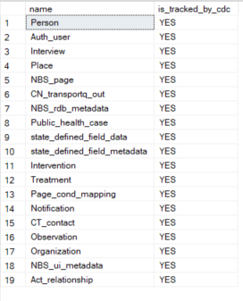
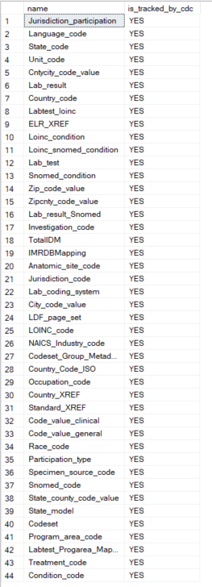

# Deploy the real-time reporting (RTR) add-on

Real-time reporting (RTR) is an optional, near-real-time add-on for NBS 7. RTR reduces reporting latency from up to 24 hours in legacy NBS 6 to between 5 minutes and 1 hour by replacing batch processing through `MasterETL` with streaming through Kafka Connect.

This guide covers deploying RTR end to end with Helm charts. RTR streams row-level changes from selected `NBS_ODSE` and `NBS_SRTE` tables into Kafka topics, then loads those changes into reporting data stores.

## On this page
{: .no_toc .text-delta }

1. TOC
{:toc}

> This feature is in Beta preview and not production ready.
{: .important }

The database scripts referenced in this guide are maintained in the [DataReporting](https://github.com/CDCgov/NEDSS-DataReporting/tree/main/liquibase-service) repository. Required database objects can be created either through Liquibase or by manual script execution. Both options are referenced in the relevant sections.

If you encounter issues during database setup, contact support at <mailto:nbs@cdc.gov>.

## Prerequisites

1. Database release version: Verify the baseline NBS release version is 6.0.17. Run the following query:

   ```sql
   USE NBS_ODSE;
   SELECT max(Version) current_version
   FROM NBS_ODSE.dbo.NBS_Release;
   ```

  Or run the following query to check the config value:

   ```sql
   use [NBS_ODSE];
   select * from NBS_configuration where config_key = 'CODE_BASE'
   ```

2. **Classic ETL: Ensure these ETL batch jobs have run successfully before setting up the reporting database for real-time reporting (RTR).**
   - a. ETL scheduled jobs:
   - `MasterEtl.bat`
   - `PHCMartETL.bat`
   - `covid19ETL.bat`
   - b. **Note: Ensure to take a backup of rdb database before proceeding with the next steps**
   - c. Database setup options:
     - **Option 1:** Use `RDB` as the default database for real-time reporting (RTR). Turn off the classic ETL batch jobs and proceed with onboarding.
     - **Option 2:** Create a separate database (`rdb_modern`) for real-time reporting (RTR). Steps are listed under [Create rdb_modern database (optional)](#create-rdb_modern-database-optional).

3. Environment variable: Set the appropriate environment variable to define the reporting database context. This ensures scripts execute against the correct reporting database.

  Option 1 (`RDB` as the default database): Insert the following value into `NBS_configuration`:

  ```sql
  IF NOT EXISTS(SELECT 1 FROM NBS_ODSE.DBO.NBS_configuration WHERE config_key ='ENV' AND config_value ='PROD')
  INSERT INTO NBS_ODSE.dbo.NBS_configuration
  (config_key, config_value, short_name, desc_txt, default_value, valid_values, category, add_release, version_ctrl_nbr, add_user_id, add_time, last_chg_user_id, last_chg_time, status_cd, status_time, admin_comment, system_usage, config_value_large)
  VALUES(N'ENV', N'PROD', N'RTR reporting database', N'Indicates scripts should be run against RDB database', NULL, N'UAT, PROD', N'RTR', N'7.11.0', 1, 0, getdate(), 0, getdate(), N'A', getdate(), NULL, NULL, NULL);
  ```

  Option 2 (`rdb_modern` as the default database): This setting overrides the default `RDB` during script execution unless a script explicitly prompts for a database.

  ```sql
  IF NOT EXISTS(SELECT 1 FROM NBS_ODSE.DBO.NBS_configuration WHERE config_key ='ENV' AND config_value ='UAT')
  INSERT INTO NBS_ODSE.dbo.NBS_configuration
  (config_key, config_value, short_name, desc_txt, default_value, valid_values, category, add_release, version_ctrl_nbr, add_user_id, add_time, last_chg_user_id, last_chg_time, status_cd, status_time, admin_comment, system_usage, config_value_large)
  VALUES(N'ENV', N'UAT', N'RTR reporting database', N'Indicates scripts should be run against UAT rdb_modern database', NULL, N'UAT, PROD', N'RTR', N'7.11.0', 1, 0, getdate(), 0, getdate(), N'A', getdate(), NULL, NULL, NULL);
  ```

## Create rdb_modern database (optional)

If a separate database is required for UAT, restore `RDB` as `rdb_modern`. This keeps the classic ETL-hydrated `RDB` available while hosting components needed for real-time reporting (RTR). If you use AWS RDS, run the following steps.

- i. Backup RDB
  - a. Login into AWS Account.
  - b. Navigate to RDS.
  - c. Ensure the RDS SQL Server has the Option for Backup and Restore Enabled in Options group.
  - d. Open any SQL Client and connect to SQL Server RDS instance.
  - e. Backup database to AWS S3.
  - Run this procedure to back up the SQL Server database to S3.

      ```sql
      exec msdb.dbo.rds_backup_database
      @source_db_name='RDB',
      @s3_arn_to_backup_to='arn:aws:s3:::cdc-nbs-state-upload-shared/Classic-6.0.16/rdb_classic_2024_07_22_5pmet.bak',
      @type='FULL'
      ```

  - Run the procedure to check the status.

      ```sql
      exec msdb.dbo.rds_task_status;
      ```

- ii. Restore rdb_modern:
  - a. Open any SQL Client and connect to SQL Server RDS instance.
  - b. Restore RDB as rdb_modern by executing the following procedure.

   ```sql
   exec msdb.dbo.rds_restore_database
   @restore_db_name='rdb_modern',
   @s3_arn_to_restore_from='arn:aws:s3:::cdc-nbs-state-upload-shared/Classic-6.0.16/rdb_classic_gdit_07_10_5pmet.bak',
   @type='FULL';
   ```

- Run the procedure to check the status.

```sql
exec msdb.dbo.rds_task_status;
```

## Create service users and database objects

Complete these one-time onboarding steps for real-time reporting (RTR) setup.

1. Create database users: Each user should have only the permissions required for its role. **Review the scripts and update the `PASSWORD` values before execution.**

- a. Create admin user: This user provides Liquibase permissions to maintain required database components for real-time reporting (RTR) and enable Change Data Capture on tables.
  - Script location: [NEDSS-DataReporting onboarding user creation scripts](https://github.com/CDCgov/NEDSS-DataReporting/tree/main/liquibase-service/src/main/resources/db/001-master/01_onboarding_scripts_user_creation)
- b. Create RTR microservice user logins: Create dedicated user accounts for each RTR microservice. These users are referenced in Helm values for RTR services.
  - Script location: [NEDSS-DataReporting onboarding user creation scripts](https://github.com/CDCgov/NEDSS-DataReporting/tree/main/liquibase-service/src/main/resources/db/001-master/01_onboarding_scripts_user_creation)

2. Create Kubernetes secrets: Kubernetes secrets are required for RTR services to access the database. Create secrets for each service user from step 1. (Ignore this step if secrets were already created in [create secrets in your cluster](../../../docs/deploy-nbs7/initial-kubernetes-deployment/initial-kubernetes-deployment.html#create-secrets-in-your-cluster).)

- a. Create secrets for each service user, including the admin user from step 1a. Each secret should include the database username and password.
  - Script location: [NEDSS-DataReporting/create-kubernetes-secrets](https://github.com/CDCgov/NEDSS-Helm/blob/main/k8-manifests/nbs-secrets.yaml)

3. Create required database objects: Scripts required for RTR can be executed with Liquibase or manually.

- Option 1: If Liquibase is the preferred approach, please refer to steps in the [Liquibase](../../../docs/deploy-nbs7/real-time-reporting/liquibase.html) section to create all necessary objects before moving to step 4.
- Option 2: The required database objects can also be manually created. Documentation on script execution sequence and supplemental `db_upgrade.bat` file is provided to support manual setup.
  - Script location: [NEDSS-DataReporting/db-upgrade](https://github.com/CDCgov/NEDSS-DataReporting/tree/main/liquibase-service/src/main/resources/stlt/manual_deployment)
  - Please specify the database and proceed:
  - `upgrade_db.bat server_name <database> username password`

4. Load data and enable Change Data Capture: This one-time onboarding step is required after all database objects are created in step 3.

- a. Option 1: Manually execute scripts. Review and run scripts in the [data_load](https://github.com/CDCgov/NEDSS-DataReporting/tree/main/liquibase-service/src/main/resources/stlt/manual_deployment) folder.
  - i. Load metadata rows from NBS_ODSE and NBS_SRTE database tables to the reporting database.
    - Script location: [000-nrt_metadata_load.sql](https://github.com/CDCgov/NEDSS-DataReporting/blob/main/liquibase-service/src/main/resources/db/001-master/02_onboarding_script_data_load/000-nrt_metadata_load-001.sql)
  - ii. Data load to nrt_<>_key tables
  - Run remaining onboarding scripts starting from `/02_onboarding_script_data_load/001-*`.
  - Script location: [/02_onboarding_script_data_load/001-*.sql](https://github.com/CDCgov/NEDSS-DataReporting/tree/main/liquibase-service/src/main/resources/db/001-master/02_onboarding_script_data_load)
  - iii. Enable Change Data Capture on `NBS_ODSE` and `NBS_SRTE` databases and tables:
  - These are the final scripts that should be run before go-live.
    - a. [1002-enable_cdc_on_odse_database.sql](https://github.com/CDCgov/NEDSS-DataReporting/blob/main/liquibase-service/src/main/resources/db/001-master/02_onboarding_script_data_load/1002-enable_cdc_on_odse_database-001.sql)
    - b. [1003-enable_cdc_on_srte_database.sql](https://github.com/CDCgov/NEDSS-DataReporting/blob/main/liquibase-service/src/main/resources/db/001-master/02_onboarding_script_data_load/1003-enable_cdc_on_srte_database-001.sql)
    - c. [1004-enable_cdc_on_odse_tables.sql](https://github.com/CDCgov/NEDSS-DataReporting/blob/main/liquibase-service/src/main/resources/db/001-master/02_onboarding_script_data_load/1004-enable_cdc_on_odse_tables-001.sql)
    - d. [1005-enable_cdc_on_srte_tables.sql](https://github.com/CDCgov/NEDSS-DataReporting/blob/main/liquibase-service/src/main/resources/db/001-master/02_onboarding_script_data_load/1005-enable_cdc_on_srte_tables-001.sql)
- b. Option 2: `db_upgrade.bat` file with `--load-data` flag run against the master database.
  - Script location: [NEDSS-DataReporting/db-upgrade](https://github.com/CDCgov/NEDSS-DataReporting/tree/main/liquibase-service/src/main/resources/stlt/manual_deployment)
  - `upgrade_db.bat --load-data server_name master username password`

   ```sql
      --Verify change data capture. is_cdc_enabled=1 indicates successful configuration.
       SELECT name,
       is_cdc_enabled
       FROM sys.databases;

      --View ODSE tables with CDC enabled.
       USE NBS_ODSE;
       SELECT
       name,
       case when is_tracked_by_cdc   = 1 then 'YES'
       else 'NO' end as is_tracked_by_cdc
       FROM sys.tables
       WHERE is_tracked_by_cdc = 1;

      -- View SRTE tables with CDC enabled
       USE NBS_SRTE;
       SELECT
       name,
       case when is_tracked_by_cdc   = 1 then 'YES'
       else 'NO' end as is_tracked_by_cdc
       FROM sys.tables
       WHERE is_tracked_by_cdc = 1;
   ```

   

   

***Troubleshooting tip:*** After `rdb_modern` is restored, if the Change Data Capture is not producing data, run the following script:

```sql
-- Change DB owner after backup/restore
USE NBS_ODSE;
EXEC sp_changedbowner 'sa';
```

## Ongoing database upgrades

After onboarding, future enhancements will be delivered using these two approaches.

- Option 1: Execute Liquibase with the provided release tag. If Liquibase is the preferred method, please refer to steps in the [Liquibase](../../../docs/deploy-nbs7/real-time-reporting/liquibase.html) section.
- Option 2: Manually execute the scripts located under [manual_deployment](https://github.com/CDCgov/NEDSS-DataReporting/tree/main/liquibase-service/src/main/resources/stlt/manual_deployment). Onboarding scripts are excluded.

---

## Deploy RTR services

Next, deploy the RTR services in the following order:

- [Liquibase](../../../docs/deploy-nbs7/real-time-reporting/liquibase.html)
- [Debezium](../../../docs/deploy-nbs7/real-time-reporting/debezium.html)
- [Kafka connector](../../../docs/deploy-nbs7/real-time-reporting/kafka-connector.html)
- [Java services](../../../docs/deploy-nbs7/real-time-reporting/rtr-java-services.html)
  - `observation-reporting-service`
  - `person-reporting-service`
  - `organization-reporting-service`
  - `investigation-reporting-service`
  - `ldfdata-reporting-service`
  - `post-processing-reporting-service`

RTR services use Kubernetes secrets for database credentials. See [create secrets in your cluster](../../../docs/deploy-nbs7/initial-kubernetes-deployment/initial-kubernetes-deployment.html#create-secrets-in-your-cluster).
{: .note }
