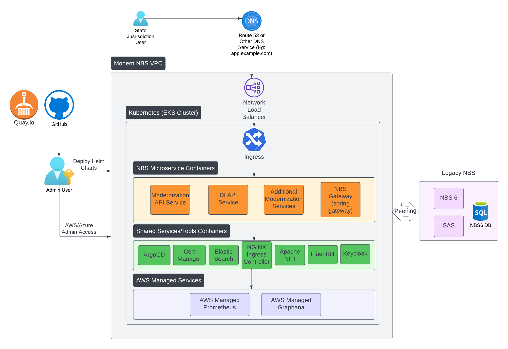

# NBS 7 architecture and microservices
{: .no_toc}

## On this page
{: .no_toc .text-delta }

1. TOC
{:toc}

---

## Overview

The deployment of the modernized NBS 7 will complement and build upon the existing NBS 6 system, integrating through the strangler fig pattern. Users will experience a smooth transition between the modern NBS 7 features and legacy NBS 6.

NBS 7 will be hosted on a separate Virtual Private Cloud (VPC) to prevent any disruptions to the existing Classic NBS. These two VPCs will be interconnected to facilitate RDS access and other communication requirements.

## Architecture

The architecture diagram below illustrates the key components of NBS 7.

## Infrastructure as Code (IaC)

The cloud environment for hosting NBS 7 is set up and configured using an [infrastructure as code](https://en.wikipedia.org/wiki/Infrastructure_as_code) approach. [Terraform](https://www.terraform.io/) code is used to provision and manage the cloud hosting environment, and [Helm](https://helm.sh/) is used to manage workloads in the [Kubernetes](https://kubernetes.io/) cluster. The code will be distributed from [GitHub](https://github.com/CDCgov).

- The [Terraform](https://www.terraform.io/) modules provided will establish the NBS infrastructure within a dedicated VPC. This includes deploying Amazon Elastic Kubernetes Service (Amazon EKS), nodes, EBS storage, and provisioning EFS for persistent storage.
- Terraform will also handle the creation of essential networking resources, such as private/public subnets, NAT gateways, Internet Gateways, and VPC peering.
- Additionally, Terraform will automate the setup of [Helm](https://helm.sh/) charts, including Fluent Bit and Cert Manager, and configure AWS-managed services such as AMP and AMG. <!-- [SME REVIEW] Stale: Fluent Bit replaced by OTEL collector; update with the architecture page pass (STLT-536). -->

## NBS Microservices

NBS 7 introduces microservices for the modernized system, deployed using [Helm](https://helm.sh/) charts:

- **Modernization API Service**: This service incorporates essential NBS 7 features such as patient search, event search, patient profile, investigations, etc.
- **NBS-gateway Service**: Leveraging Spring Cloud Gateway, this service efficiently manages intricate strangler routing logic between NBS 7 and NBS 6.
- **Data Ingestion API Service**: Our dedicated service provides essential APIs that enable NBS to seamlessly ingest HL7 data from labs and other entities into the NBS system.

## NGINX Ingress

NGINX is deprecated and is replaced with Traefik.
{: .important }

Serving as the entry point into the [Kubernetes](https://kubernetes.io/) cluster, NGINX Ingress will intelligently route users based on predefined routing rules. Users will be directed to the NBS 7 features (Modernization API Service) or classic NBS 6 features (NBS-gateway Service). The deployment of NGINX Ingress will be orchestrated using [Helm](https://helm.sh/) charts and values files.

## Shared services, tools, and containers

- **Cert Manager**: This tool automates TLS certificate management and will be integrated into the infrastructure via [Terraform](https://www.terraform.io/). The certificate issuer connects to Let's Encrypt CA by default, and will be installed using YAML manifests and `kubectl` commands.
- **Apache NiFi**: As an ETL tool, Apache NiFi populates Elasticsearch indices from the NBS database. Deployment of NiFi will follow [Helm](https://helm.sh/) charts and values files.
- **Elasticsearch**: NBS relies on Elasticsearch for lightning-fast searches. The deployment of Elasticsearch will use [Helm](https://helm.sh/) chart and values files.
- **Fluent Bit**: Fluent Bit serves as the log aggregator, collecting logs from various microservices and [Kubernetes](https://kubernetes.io/) components and, by default, pushing them to designated S3 buckets and CloudWatch. <!-- [SME REVIEW] Stale: Fluent Bit replaced by OTEL collector; update with the architecture page pass (STLT-536). -->

## Data ingestion service

Provides necessary foundational pieces to track and route ELR data flowing into NBS, and lays the groundwork to provide additional ingestion options for NBS.

- Accepts a variety of electronic lab reports using different versions and fields
- Saves all incoming messages for auditing, debugging, and disaster recovery and you can configure how long messages are saved
- Verifies all input data (HL7) against standard rules and provides an error when rejected
- Supports both positive and negative lab results with the appropriate code
- Provides both syntactic and semantic validations
- Removes unwanted data such as extraneous logs using filters
- Provides duplication checks to see if the data has made it through the system before
- Includes error handling and logging for both business data and operation data for situational awareness
- Supports traffic and system health monitoring

## Real-Time Reporting (RTR) microservices
Real-Time Reporting (RTR) provides rapid transformation and delivery of data from the transactional database (NBS_ODSE) to the reporting database (RDB). For detailed RTR deployment instructions, see [Deploy real-time reporting](../deploy-nbs7/microservices-deployment/real-time-reporting/real-time-reporting.html).

The following services comprise RTR:

- **Reporting Pipeline service**: Consumes ODSE/SRTE change events from Kafka, uses stored procedures to transform them, and hydrates the dimensions, facts, and datamarts of the reporting database in near real time.
- **Debezium service**: Monitors and streams the selected list of `NBS_ODSE` and `NBS_SRTE` tables to Kafka topics.
- **Kafka sink service**: Persists the data from the Kafka topics to the `RDB_Modern` database tables.

## Data processing service

The NBS 7 data processing service provides a way to process electronic lab reports (ELRs) in near real-time instead of depending on the system-bounded ELR batch job.

## Keycloak

Keycloak is an open-source identity and access management tool. NBS 7 uses Keycloak as the primary Identity Provider (IdP) for authentication, token management, and SSO integration with external identity providers such as Okta using OAuth or SAML.
